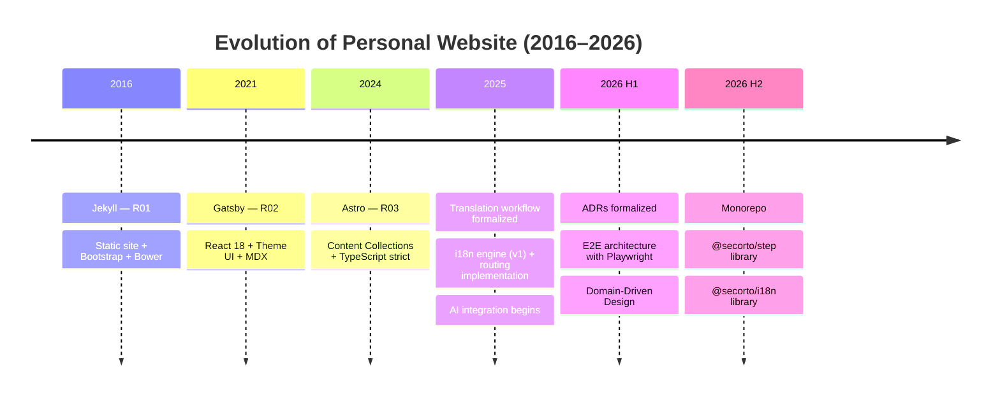

For ten years I have maintained websites, published content, and learned to live
with the evolution of the stack, the community, and my own digital identity.

The thread that connects it all has not been just the technology or the latest
framework. The real constant has been the need to sustain something alive: useful
content, clear processes, and a digital presence that does not break over time.

And that journey was not linear. It was not a story in which “my personal
website” imposed itself over the other projects, nor a sequence in which one
technology simply replaced another without more. It was, rather, a cross-evolution
between two very different contexts: the community web, where the goal was to
sustain a real space for many people, and the personal web, where I had more
freedom to experiment, document, and formalize decisions.

The relationship between both contexts was mutually productive. In a community
like PyBAQ, the main problem was maintaining a site that was useful, readable,
and maintainable for people who did not necessarily want to deal with technical
complexity. In my personal site, on the other hand, I could try more things,
rethink structures, introduce better practices, and make the architecture of
content, tests, and documentation more explicit.

It was not a hierarchy between projects. It was a dialogue.

## The community web as a real context

Before my personal site became a more formal and documented version of my
practice, I was already working on community projects with real requirements:
updated content, periodic publications, events, external sources, and a workflow
that did not depend on a single person.

In PyBAQ, for example, the site was not just a presentation card. It had to
help inform, collaborate, publish content, and keep events, community content,
and activities updated. That kind of project teaches an important lesson: when
the web stops being a portfolio and becomes a living system, everything changes.

Many decisions that later became clearer on my personal website were already
present there in practical form:

- structured content instead of loose text
- updating information from external sources
- automating repetitive tasks
- balancing simplicity and maintainability
- the need to publish without depending on fragile or manual processes

That is what the community experience left me with: not only the value of
content, but the discipline needed to sustain it.

## The personal web as a freer laboratory

My personal site had another advantage: space to experiment without the direct
pressure of an active community and without the need to prioritize a solution
that was simply “appropriate” for the audience.

That allowed me to do things that are not always possible on a community site
without introducing more complexity than the project really needs. There were
stages where I could test technologies, change approaches, reorganize content,
and create a more rigorous and conscious workflow.

The introduction of i18n, the documentation of decisions, the organization of
content, and the discipline of tests were not just “technical improvements”.
They were a response to a bigger problem: how to build a website that not only
works, but can also evolve without becoming chaotic.

In other words, my personal site became a space where practice became more
explicit:

- clearer what needs to be sustained
- clearer how information is organized
- clearer how changes are validated
- clearer which decisions matter and why

That does not replace the community experience. It complements it.

## The evolution was not a straight line of “better frameworks”

One of the biggest mistakes when we talk about websites is to act as if
everything were a ladder of technology: Jekyll, then Gatsby, then Astro, then
something else. Reality is more interesting and more human.

Each stage responded to different problems.

Jekyll taught me the speed and clarity of a well-made static site. Gatsby
showed me that the power of a modern ecosystem also brings more complexity, and
that the framework should not be chosen by reputation alone but by the clarity
of the problem it solves. Astro showed me that a combination of simplicity,
performance, and well-thought structure can be a strong point for both a
personal website and a content project.

It was not an impeccable journey or a linear evolution without mistakes. There
were decisions that only made sense later. There were moments when complexity
seemed like progress, but in retrospect it was not always the best solution for the
real problem.

And that is exactly the most valuable lesson: it is not about choosing the
“best stack” as a universal truth, but about choosing the tool that best matches
the content, context, and life of the project.
As the site evolved, more recent decisions were formalized through Architecture
Decision Records (ADRs)—a practice that makes the rationale behind choices
explicit and trackable. The timeline below shows how this evolved.

## Formalizing decisions: Architecture Decision Records

As the site matured, documenting architectural decisions became crucial. This
is why we started maintaining **ADRs** (Architecture Decision Records)—a
practice that captures not just *what* was chosen, but *why* and *when*, and
what trade-offs were accepted.

The initial decisions (ADR 001–004) covered the fundamentals: i18n routing,
testing strategy, mocking third-party dependencies, and code quality standards.
But the conversation did not stop there. Over time, more complex decisions
emerged around content structure, testing architecture for client scripts,
markdown validation, asymmetric i18n routes, page object hierarchies, and even
the monorepo structure itself (ADR 016).

One particularly significant decision was formalizing the use of AI assistants
in the development process (ADR 005, January 2026). What began as informal
experimentation in 2025—using AI to accelerate specific tasks like test
generation, type refactoring, and boilerplate—eventually required explicit
guardrails and policies. The decision was simple but important: AI accelerates
the work, but does not define the architecture. Every suggestion needed human
validation, testing, and review. This formal integration meant that the
acceleration could scale sustainably without compromising code quality or
architectural coherence.

This is not just documentation for the sake of it. ADRs serve a specific
purpose: they make it possible to onboard new contributors, understand why
certain choices were made years later, and evaluate whether old decisions still
serve the current context or need to be revisited.

It is a practice that originated in more mature engineering teams, but it has
proven invaluable even for a one-person site. The discipline of writing "why"
forces clearer thinking about trade-offs.

Yet, looking back at ADR 001, 007, and 011 together—routing, content identity,
and translation semantics—the thread becomes clear: all of them applied the same
principle. Domain-Driven Design. Clear boundaries, explicit identity, contracts
that were verifiable. The same pattern appeared in testing (page objects, user
journeys, distinct layers) and in content management (asymmetric routes, unified
identity, translationKey as semantic contract). It was not coincidence. It was
architecture beginning to speak a common language.

## Playwright, Cypress, and the maturity of quality

Another major difference between the community web and the personal web was the
maturity of automated quality.

On the personal site I was able to introduce stricter E2E tests and work with a
clearer testing architecture. That does not mean the community site had no
automation. It means the context of my personal site gave me more room to define
a QA strategy that was more explicit, documented, and sustainable.

The idea was never “to do testing just for the sake of it.” The idea was to
understand something that is often forgotten:

- a website is not validated only by opening it manually
- quality is not just opinion or aesthetics
- when content and navigation grow, automation stops being a luxury and
  becomes a necessity

In that sense, the community experience taught me to value real maintenance; the
personal site taught me to formalize quality.

And that formalization took the shape of Domain-Driven Design applied to testing.
Page objects became domain entities with clear responsibilities. User journeys
became explicit narratives of business value. Test steps became contracts with
verifiable outcomes. The testing pyramid was no longer just a technical structure;
it was an expression of the domain itself—boundaries, identity, consistency.

## Automation and testing maturity across different contexts

When talking about automation on community websites, it is also important to be
honest about context.

In PyBAQ, automation was more focused on solving concrete problems: updating
events, reducing repetitive work, reducing friction, and avoiding fragile
manual processes. At that stage, automation functioned as support for the
operation of the site, not necessarily as a sophisticated testing architecture.

On my personal site, automation became more deliberate and more mature. I
started thinking about validation as part of the system design, not just as a
contingency layer at the end.

This is not a comparison of “better or worse.” It is simply two different levels
of maturity within the same evolution.

## When patterns become packages: from monolith to reusable libraries

By mid-2026, something became inevitable: the patterns had matured enough to be
extracted. The monorepo structure (introduced in August 2026) was not just a
technical reorganization. It was a recognition that Domain-Driven Design had
crystallized into distinct, reusable domains.

[@secorto/step](/en/project/step) emerged as the testing library—Page Objects, User Journeys, and
test orchestration as first-class abstractions. [@secorto/i18n](/en/project/i18n) emerged as the
content identity library—asymmetric routes, translation keys, and domain invariants
made explicit and portable. Both were expressions of the same principle: extract
the model, make it portable, let it guide future decisions.

The monorepo did not create these patterns. It formalized and protected them.

## The mutualism of ideas

If something has become clear over these ten years, it is that ideas do not
come from a single place or materialize in a single website.

There is a constant feedback loop between:

- community practice
- personal experimentation
- site architecture
- the chosen tool
- the clarity of the publication idea

PyBAQ gave me a real environment to understand how to maintain a site in
context. My personal website gave me more freedom to put words to what I was
learning, test it, and document it. The ideas crossed. It was not a relationship
of first and second place; it was a relationship of mutualism.

The community taught me how to maintain content with less noise and more
continuity. My personal site taught me how to turn that learning into a more
conscious architecture, with better DX, better documentation, and stronger
technical judgment.

## The most important conclusion

After a decade of Jamstack, the most valuable idea is not “what stack I used”,
but how I learned to sustain a site over time.

The real secret is not in having a more modern website or a framework with more
hype. The secret is that the website remains useful, clear, maintainable, and
adaptable as needs change.

That is why the evolution between PyBAQ and my personal page is not a story of
competition, but of complementarity.

- The community taught me how to maintain real content.
- The personal website taught me how to formalize the practice.
- Shared experience taught me that a website is not just an interface, but a
  living system that must be cared for.

And that is the real lesson of 10 years of Jamstack: it is not only about
choosing the best technology, but about understanding that each site reflects
the reality of the people who sustain it.

---

Looking back, the biggest difference has not been the technology, but the
maturity with which I understood the problem.

It was not only “how to build a site.” It was “how to sustain a digital
presence over time,” without losing clarity, without losing meaning, and without
stopping to learn.

That is what matters most from this decade.

---

## Appendix: Where these decisions are documented

The architectural decisions mentioned in this post are part of a formal
Architecture Decision Records (ADR) repository. If you are interested in the
technical details of specific choices—i18n routing strategies, testing
architecture, monorepo setup, or page object patterns—these are documented in
the project's
[/docs/adr/](https://github.com/secorto/secorto_web/tree/master/docs/adr) (in spanish) directory.

The ADRs capture not just *what* was chosen, but *why* and *when*, including
the context and trade-offs. This approach helps maintain clarity as a project
grows and makes it easier to revisit decisions when circumstances change.
