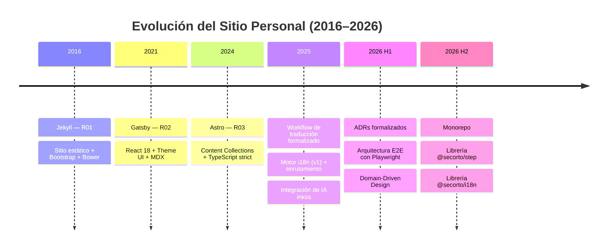

Durante diez años he mantenido sitios web, publicado contenido y aprendido a
vivir con la evolución del stack, la comunidad y mi propia identidad digital.

El hilo que lo conecta todo no ha sido solo la tecnología o el framework más
reciente. La constante real ha sido la necesidad de sostener algo vivo: contenido
útil, procesos claros y una presencia digital que no se quiebre con el tiempo.

Y ese viaje no fue lineal. No fue una historia en la que "mi sitio personal" se
impusiera sobre los otros proyectos, ni una secuencia en la que una tecnología
simplemente reemplazara a otra sin más. Fue, más bien, una evolución cruzada
entre dos contextos muy diferentes: la web comunitaria, donde el objetivo era
sostener un espacio real para muchas personas, y la web personal, donde tenía
más libertad para experimentar, documentar y formalizar decisiones.

La relación entre ambos contextos fue mutuamente productiva. En una comunidad
como PyBAQ, el problema principal era mantener un sitio que fuera útil, legible
y mantenible para personas que no necesariamente querían lidiar con la complejidad
técnica. En mi sitio personal, en cambio, podía probar más cosas, repensar
estructuras, introducir mejores prácticas y hacer más explícita la arquitectura
del contenido, las pruebas y la documentación.

No fue una jerarquía entre proyectos. Fue un diálogo.

## La web comunitaria como contexto real

Antes de que mi sitio personal se convirtiera en una versión más formal y
documentada de mi práctica, ya estaba trabajando en proyectos comunitarios con
requisitos reales: contenido actualizado, publicaciones periódicas, eventos,
fuentes externas y un flujo de trabajo que no dependiera de una sola persona.

En PyBAQ, por ejemplo, el sitio no era solo una tarjeta de presentación. Tenía
que ayudar a informar, colaborar, publicar contenido y mantener actualizado los
eventos, el contenido comunitario y las actividades. Ese tipo de proyecto enseña
una lección importante: cuando la web deja de ser un portafolio y se convierte en
un sistema vivo, todo cambia.

Muchas decisiones que luego se hicieron más claras en mi sitio personal ya
estaban presentes allí de forma práctica:

- contenido estructurado en lugar de texto suelto
- actualizar información de fuentes externas
- automatizar tareas repetitivas
- equilibrar simplicidad y mantenibilidad
- la necesidad de publicar sin depender de procesos frágiles o manuales

Eso es lo que la experiencia comunitaria me dejó: no solo el valor del
contenido, sino la disciplina necesaria para sustentarlo.

## La web personal como un laboratorio más libre

Mi sitio personal tenía otra ventaja: espacio para experimentar sin la presión
directa de una comunidad activa y sin la necesidad de priorizar una solución que
fuera simplemente "apropiada" para la audiencia.

Eso me permitió hacer cosas que no siempre son posibles en un sitio comunitario
sin introducir más complejidad de la que el proyecto realmente necesita. Hubo
etapas en las que podía probar tecnologías, cambiar enfoques, reorganizar
contenido y crear un flujo de trabajo más riguroso y consciente.

La introducción de i18n, la documentación de decisiones, la organización del
contenido y la disciplina de las pruebas no fueron solo "mejoras técnicas".
Fueron una respuesta a un problema más grande: cómo construir un sitio web que
no solo funcione, sino que también pueda evolucionar sin volverse caótico.

En otras palabras, mi sitio personal se convirtió en un espacio donde la práctica
se hizo más explícita:

- más claro qué necesita ser sustentado
- más claro cómo se organiza la información
- más claro cómo se validan los cambios
- más claro cuáles decisiones importan y por qué

Eso no reemplaza la experiencia comunitaria. La complementa.

## La evolución no fue una línea recta de "frameworks mejores"

Uno de los mayores errores cuando hablamos de sitios web es actuar como si
todo fuera una escalera de tecnología: Jekyll, luego Gatsby, luego Astro, luego
algo más. La realidad es más interesante y más humana.

Cada etapa respondió a problemas diferentes.

Jekyll me enseñó la velocidad y la claridad de un sitio estático bien hecho.
Gatsby me mostró que el poder de un ecosistema moderno también trae más
complejidad, y que el framework no debe ser elegido por reputación sola sino
por la claridad del problema que resuelve. Astro me mostró que una combinación
de simplicidad, rendimiento y estructura bien pensada puede ser un punto fuerte
tanto para un sitio personal como para un proyecto de contenido.

No fue un viaje impecable ni una evolución lineal sin errores. Hubo decisiones
que solo cobraron sentido después. Hubo momentos en los que la complejidad
parecía progreso, pero en retrospectiva no siempre fue la mejor herramienta
para el problema real.

Y esa es exactamente la lección más valiosa: no se trata de elegir el "mejor
stack" como una verdad universal, sino de elegir la herramienta que mejor se
ajuste al contenido, contexto y vida del proyecto.

A medida que el sitio evolucionó, las decisiones más recientes se formalizaron
a través de Registros de Decisiones Arquitectónicas (ADRs, por sus siglas en
inglés)—una práctica que hace explícita y rastreable la razón detrás de cada
elección. La línea de tiempo a continuación muestra cómo esto evolucionó.

## Formalizando decisiones: Registros de Decisiones Arquitectónicas

A medida que el sitio maduraba, documentar las decisiones arquitectónicas se
volvió crucial. Por eso comenzamos a mantener **ADRs** (Architecture Decision
Records)—una práctica que captura no solo *qué* se eligió, sino *por qué* y
*cuándo*, y qué compensaciones se aceptaron.

Las decisiones iniciales (ADR 001–004) cubrieron los fundamentos: enrutamiento
i18n, estrategia de pruebas, mocking de dependencias de terceros y estándares
de calidad de código. Pero la conversación no se detuvo allí. Con el tiempo,
surgieron decisiones más complejas en torno a la estructura del contenido,
arquitectura de pruebas para scripts del cliente, validación de Markdown,
rutas i18n asimétricas, jerarquías de page objects e incluso la propia
estructura del monorepo (ADR 016).

Una decisión particularmente significativa fue formalizar el uso de asistentes
IA en el proceso de desarrollo (ADR 005, enero 2026). Lo que comenzó como
experimentación informal en 2025—usar IA para acelerar tareas específicas como
generación de tests, refactoring de tipos y boilerplate—eventualmente requirió
guardrails y políticas explícitas. La decisión fue simple pero importante: la
IA acelera el trabajo, pero no define la arquitectura. Toda sugerencia necesitaba
validación humana, testing y revisión. Esta integración formal significó que la
aceleración pudiera escalar de forma sostenible sin comprometer la calidad del
código o la coherencia arquitectónica.

Esto no es solo documentación por documentar. Los ADRs sirven un propósito
específico: hacen posible incorporar nuevos colaboradores, entender por qué
se tomaron ciertas decisiones años después y evaluar si las decisiones
antiguas aún sirven al contexto actual o necesitan ser revisadas.

Es una práctica que se originó en equipos de ingeniería más maduros, pero ha
demostrado ser invaluable incluso para un sitio de una sola persona. La
disciplina de escribir "por qué" fuerza un pensamiento más claro sobre las
compensaciones.

Pero mirando hacia atrás los ADRs 001, 007 y 011 en conjunto—enrutamiento,
identidad del contenido, semántica de traducción—el hilo se vuelve claro: todos
aplicaban el mismo principio. Domain-Driven Design. Límites claros, identidad
explícita, contratos verificables. El mismo patrón aparecía en testing (page
objects, user journeys, capas distintas) y en gestión de contenido (rutas
asimétricas, identidad unificada, translationKey como contrato semántico). No
fue coincidencia. Fue arquitectura comenzando a hablar un lenguaje común.

## Playwright, Cypress y la madurez de la calidad

Otra diferencia importante entre la web comunitaria y la web personal fue la
madurez de la calidad automatizada.

En el sitio personal pude introducir pruebas E2E más rigurosas y trabajar con
una arquitectura de testing más clara. Eso no significa que el sitio comunitario
no tuviera automatización. Significa que el contexto de mi sitio personal me dio
más espacio para definir una estrategia de QA más explícita, documentada y
sostenible.

La idea nunca fue "hacer testing solo por hacerlo". La idea era entender algo
que a menudo se olvida:

- un sitio web no se valida solo abriéndolo manualmente
- la calidad no es solo opinión o estética
- cuando el contenido y la navegación crecen, la automatización deja de ser un
  lujo y se convierte en una necesidad

En ese sentido, la experiencia comunitaria me enseñó a valorar el mantenimiento
real; el sitio personal me enseñó a formalizar la calidad.

Y esa formalización tomó la forma de Domain-Driven Design aplicado al testing.
Los page objects se convirtieron en entidades de dominio con responsabilidades
claras. Los user journeys se convirtieron en narrativas explícitas de valor de
negocio. Los pasos de test se convirtieron en contratos con resultados
verificables. La pirámide de testing ya no era solo una estructura técnica; era
una expresión del dominio mismo—límites, identidad, consistencia.

## Madurez de automatización y testing en distintos contextos

Cuando se habla de automatización en sitios web comunitarios, también es
importante ser honesto sobre el contexto.

En PyBAQ, la automatización se enfocaba más en resolver problemas concretos:
actualizar eventos, reducir trabajo repetitivo, reducir fricción y evitar
procesos manuales frágiles. En esa etapa, la automatización funcionaba como
apoyo para la operación del sitio, no necesariamente como una arquitectura
sofisticada de pruebas.

En mi sitio personal, la automatización se volvió más deliberada y más madura.
Comencé a pensar en la validación como parte del diseño del sistema, no solo
como una capa de contingencia al final.

Esta no es una comparación de "mejor o peor". Es simplemente dos niveles
diferentes de madurez dentro de la misma evolución.

## Cuando los patrones se vuelven paquetes: del monolito a librerías reutilizables

Hacia mediados de 2026, algo se volvió inevitable: los patrones habían madurado
lo suficiente para ser extraídos. La estructura de monorepo (introducida en
agosto 2026) no era solo una reorganización técnica. Era un reconocimiento de que
Domain-Driven Design se había cristalizado en dominios distintos y reutilizables.

[@secorto/step](/es/proyecto/step) emergió como la librería de testing—Page Objects, User Journeys
y orquestación de tests como abstracciones de primera clase. [@secorto/i18n](/es/proyecto/i18n)
emergió como la librería de identidad de contenido—rutas asimétricas, translation
keys e invariantes de dominio hechos explícitos y portables. Ambas eran
expresiones del mismo principio: extraer el modelo, hacerlo portable, dejar que
guíe futuras decisiones.

El monorepo no creó estos patrones. Los formalizó y protegió.

## El mutualismo de las ideas

Si algo se ha aclarado durante estos diez años, es que las ideas no surgen de un
solo lugar ni se materializan en un solo sitio web.

Hay un ciclo constante de retroalimentación entre:

- la práctica comunitaria
- la experimentación personal
- la arquitectura del sitio
- la herramienta elegida
- la claridad de la idea de publicación

PyBAQ me dio un ambiente real para entender cómo mantener un sitio en contexto.
Mi sitio personal me dio más libertad para poner palabras a lo que estaba
aprendiendo, probarlo y documentarlo. Las ideas se cruzaban. No era una relación
de primer y segundo lugar; era una relación de mutualismo.

La comunidad me enseñó cómo mantener contenido con menos ruido y más
continuidad. Mi sitio personal me enseñó cómo convertir ese aprendizaje en una
arquitectura más consciente, con mejor DX, mejor documentación y mejor juicio
técnico.

## La conclusión más importante

Después de una década de Jamstack, la idea más valiosa no es "qué stack usé",
sino cómo aprendí a sostener un sitio a lo largo del tiempo.

El verdadero secreto no está en tener un sitio web más moderno o un framework
con más hype. El secreto es que el sitio siga siendo útil, claro, mantenible y
adaptable conforme cambien las necesidades.

Por eso la evolución entre PyBAQ y mi sitio personal no es una historia de
competencia, sino de complementariedad.

- La comunidad me enseñó cómo mantener contenido real.
- El sitio personal me enseñó cómo formalizar la práctica.
- La experiencia compartida me enseñó que un sitio web no es solo una interfaz,
  sino un sistema vivo que debe cuidarse.

Y esa es la verdadera lección de 10 años de Jamstack: no se trata solo de
elegir la mejor tecnología, sino de entender que cada sitio refleja la realidad
de las personas que lo sustentan.

---

Mirando hacia atrás, la diferencia más grande no ha sido la tecnología, sino
la madurez con la que entendí el problema.

No fue solo "cómo construir un sitio". Fue "cómo sostener una presencia digital
a lo largo del tiempo", sin perder claridad, sin perder significado y sin dejar
de aprender.

Eso es lo que más importa de esta década.

---

## Apéndice: Dónde se documentan estas decisiones

Las decisiones arquitectónicas mencionadas en este post forman parte de un
repositorio formal de Registros de Decisiones Arquitectónicas (ADRs).
Si te interesa conocer los detalles técnicos de aspectos específicos — estrategias de enrutamiento i18n,
arquitectura de testing, configuración de monorepo o patrones
de page objects—estos están documentados en el directorio
[/docs/adr/](https://github.com/secorto/secorto_web/tree/master/docs/adr) del
proyecto.

Los ADRs capturan no solo *qué* se eligió, sino *por qué* y *cuándo*, incluyendo
el contexto y las compensaciones. Este enfoque ayuda a mantener la claridad
conforme un proyecto crece y facilita revisitar decisiones cuando las
circunstancias cambian.
