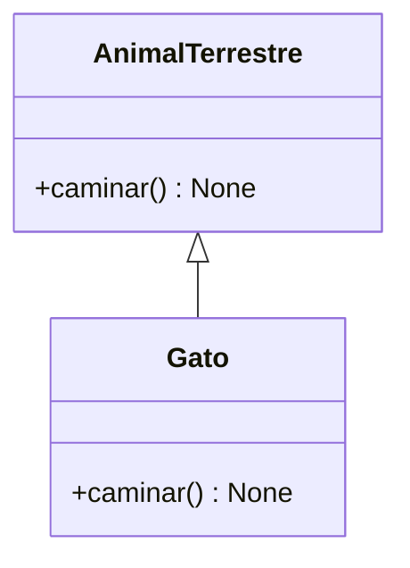
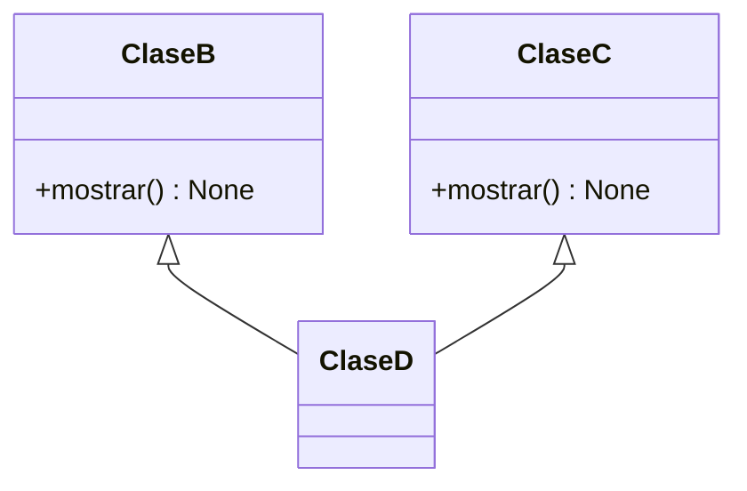
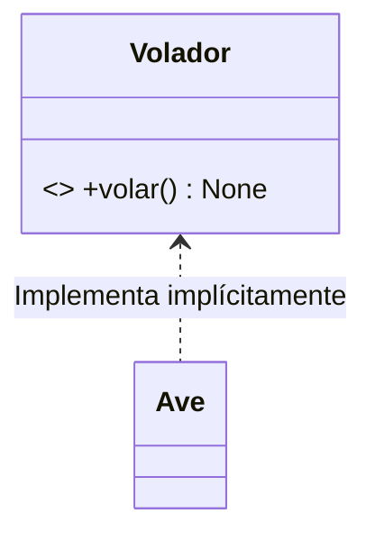

¡Bienvenido! Este artículo unifica, actualiza y reemplaza nuestras guías de 2022.
Su objetivo es servir como una **hoja de trucos (Cheatsheet) de referencia rápida y progresiva**
sobre los estándares modernos de Python, conectando la sintaxis básica con la arquitectura de objetos profesional.

## Módulo de Introducción y Sintaxis Esencial

Python es un lenguaje de programación interpretado que destaca por su facilidad de lectura,
su limpia curva de aprendizaje y su versatilidad.
Hoy en día es la herramienta líder para la automatización, el desarrollo web y la ciencia de datos.

Para ir directo al código sin preocuparnos por instalaciones locales o entornos virtuales,
utilizaremos **Jupyter Notebooks** (a través de Google Colab),
una herramienta estándar organizada en bloques de **Texto** (Markdown) y **Código** (Python ejecutable).

### Variables, Números y Colecciones

En Python las variables no necesitan una declaración formal de tipo para crearse.
Manejamos enteros (`int`), cadenas de texto (`str`) y colecciones de datos esenciales:

```python
# Variables y asignación básica
nombre = "Sergio"
print("Hola " + nombre) # Concatenación tradicional

# Colecciones: Listas (mutables), Tuplas (inmutables) y Diccionarios (clave-valor)
lista_mutas = ["a", "b", "c", "a"]
tupla_inmutable = ("a", "b", "c", "a")
diccionario_datos = {"nombre": "Sergio", "apellido": "Orozco"}
```

*💡 **Nota de precisión:** Evita usar `float` para dinero debido a pérdidas de precisión en base 2.
En su lugar, se importa la clase `Decimal` mediante `from decimal import Decimal`.*

### Flujos de Control y Ciclos

Evaluamos condiciones lógicas mediante `if/elif/else` e iteramos datos usando bucles `for` o condiciones continuas con `while`:

```python
# Condicionales tradicionales
if edad >= 18:
    print("¿Nos tomamos unas polas?")
else:
    print("¿Quieres un helado?")

# Ciclos (for / while)
numeros = [2, 3, 6, 8]
cuadrados = [numero ** 2 for numero in numeros] # List comprehension
```

### Funciones y Type Hints

Una vez dominadas las variables, creamos bloques de código reutilizables usando la palabra reservada `def`.
Añadimos *Type Hints* para documentar qué datos espera una función y qué devuelve,
mejorando el autocompletado y evitando bugs en etapas tempranas:

```python
# Una función moderna con documentación de tipos estáticos
def saludar(nombre: str) -> str:
    return f"Hola, {nombre}!" # f-string para interpolación limpia

mensaje: str = saludar("Sergio")
```

### 🚀 Laboratorio Práctico de Sintaxis

Ahora que entiendes la base, abre el primer laboratorio interactivo en Google Colab
para experimentar, modificar y ejecutar el código de sintaxis esencial en vivo:

[](https://colab.research.google.com/gist/Scot3004/8c8d0251641a2070891067233298c838)

*(Nota: Al final de este primer laboratorio en Colab encontrarás un enlace para regresar directamente a esta guía
  y continuar con el módulo de objetos).*

---

## Módulo de Programación Orientada a Objetos Moderna

Cuando las estructuras de datos esenciales no bastan, escalamos hacia el paradigma orientado a objetos (POO)
para modelar problemas complejos, encapsulando estados (atributos) y acciones (métodos).

### Modelado de Datos Eficiente (`@dataclass`)

Olvídate de los diccionarios planos o de escribir constructores `__init__` repetitivos.
Las **Dataclasses** (Python 3.7+) generan automáticamente constructores y representaciones limpias en texto (`__repr__`).

```python
from dataclasses import dataclass

@dataclass
class Curso:
    titulo: str
    lenguaje: str
    estudiantes: int

curso_actual = Curso("Python Moderno", "Python", 45)
```

### Herencia y Polimorfismo

Permite que clases hijas adopten o redefinan (polimorfismo) los métodos de una clase padre.



```python
class AnimalTerrestre:
    def caminar(self) -> None: print("Animal caminando...")

class Gato(AnimalTerrestre):
    def caminar(self) -> None: print("Gato caminando silenciosamente")
```

### Herencia Múltiple (MRO) y Diamante

Python permite heredar de múltiples padres.
La ambigüedad de métodos se resuelve mediante el algoritmo **MRO (Method Resolution Order)**,
que busca de izquierda a derecha según el orden de declaración.



```python
class ClaseB:
    def mostrar(self) -> None: print("Desde B")
class ClaseC:
    def mostrar(self) -> None: print("Desde C")

class ClaseD(ClaseB, ClaseC): pass # Prioriza ClaseB por orden de declaración
```

### Duck Typing y Protocolos

En Python no necesitas heredar de interfaces rígidas; si un objeto implementa el método adecuado,
puede ser utilizado (*Duck Typing*). Usamos `Protocol` para documentarlo con tipos estáticos.



```python
from typing import Protocol

class Volador(Protocol):
    def volar(self) -> None: ...

class Ave:
    def volar(self) -> None: print("El ave bate sus alas")

def despegar(entidad: Volador) -> None: entidad.volar()
```

---

## Métodos Mágicos (Dunder Methods)

Permiten interceptar y sobrecargar operadores nativos (`+`, `-`, `==`) en tus clases personalizadas.

```python
class Punto:
    def __init__(self, x: int, y: int):
        self.x, self.y = x, y
        
    def __add__(self, other: 'Punto') -> 'Punto':
        return Punto(self.x + other.x, self.y + other.y)

# Ejecuta internamente p1.__add__(p2)
resultado = Punto(2, 4) + Punto(3, 1) 
```

---

## 🏁 Siguientes Pasos

Este artículo es un resumen de referencia rápida. Para ver las explicaciones profundas,
interactuar con el código, ver casos de borde y acceder al laboratorio de experimentación completo,
[ejecuta el Jupyter Notebook oficial directamente en Google Colab](https://colab.research.google.com/gist/Scot3004/19458c05fe160d0b7509a380f1030eaf/introduccion_python_moderno.ipynb)

---

### 🔄 Historial y Archivo de esta Guía

Este artículo unifica, actualiza y reemplaza nuestras publicaciones independientes de 2022.
Si por motivos académicos o curiosidad técnica deseas revisar los repositorios interactivos
que dieron origen a este post, puedes acceder a ellos aquí:

* **Gist Histórico - Introducción a Python (Julio 2022):** Consulta el repositorio original enfocado en sintaxis básica
  y flujos iniciales en
  [GitHub Gist](https://colab.research.google.com/gist/Scot3004/c5a562df9ca6509820f6320b5e4c6900).
* **Gist Histórico - POO en Python con PlantUML (Agosto 2022):** Accede al repositorio antiguo donde estructuramos
  por primera vez el paradigma orientado a objetos en
  [GitHub Gist](https://colab.research.google.com/gist/Scot3004//5d57573d97ed859afc5dd662556bf14c).

*Nota: Los repositorios históricos de 2022 no cuentan con la implementación moderna
  de Dataclasses ni indicaciones de tipo estáticas (PEP 484).*
