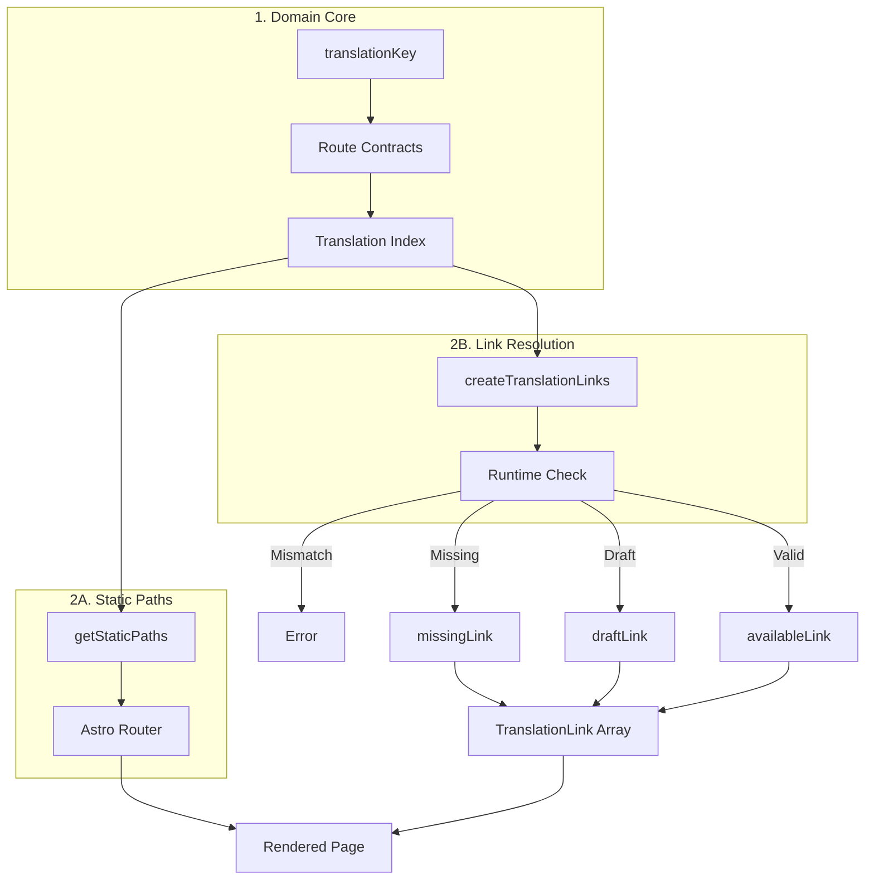

I built `@secorto/i18n` to eliminate a chronic structural failure in internationalized static sites: the coupling of
content identity with mutable public routes and locale slugs. In conventional architectures, scaling content across
highly asymmetric languages inevitably breeds duplicate URLs, orphaned paths, and silent, catastrophic SEO defects.

The library implements a strict Domain-Driven Design approach by decoupling three concerns that the industry regularly
tangles together: the immutable meaning of the content, the localized public URL, and the translation asset itself.
By modeling content around a unique, invariant `translationKey`, the system freezes identity at the core.

## Eliminating Brittle Routing and Silent SEO Failures

Instead of treating localized paths as fragile string manipulations, `@secorto/i18n` introduces compile-time route
contracts. The engine establishes immutable Value Objects for locales, sections, standalone pages, and multi-language
taxonomies. Any collision, structural asymmetry, or malformed slug triggers an immediate, explicit build-time abort.

Furthermore, the system manages translation families as unified data matrices. Every generated static page can natively
query its exact sibling routes to accurately feed alternate `hreflang` headers and language selectors on the fly,
ensuring graceful degradation (`missing` states) or strict indexing exclusion (`draft` states with noindex).

## The Role of Artificial Intelligence in Architecture

Following the engineering guardrails established in our site's ADRs, this entire routing engine was designed, co-built,
and exhaustively audited using Artificial Intelligence. Advanced LLMs were integrated into the lifecycle not to write
loose boilerplate, but to pressure-test the boundary constraints of the translation matrix.

AI acted as a structural sparring partner, simulating adversarial routing inputs, cross-linking complex asymmetric
taxonomies, and verifying that state mutations within the link resolution pipeline remained mathematically sound and
free of side effects. It represents a complex infrastructure engineered by human intent and refined through AI.

This framework successfully converts the chaotic problem of asymmetric multilingual navigation into a deterministic,
fully automated, and highly maintainable domain architecture that effortlessly scales alongside the project.
