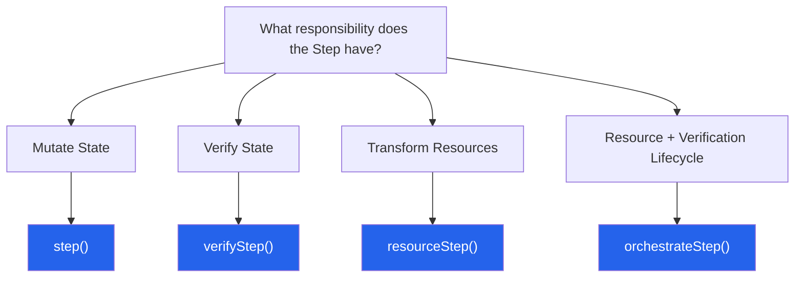

@secorto/step did not start as an elegant theoretical exercise. It was engineered out of systemic frustration — the
exact flavor of architectural friction that only surfaces when an enterprise E2E test suite scales enough to expose
its cracks.

For years, I witnessed a recurring anti-pattern: Page Objects inevitably compounding business domain intent, assertion
styles, and framework-specific reporting rules into single monolithic functions. Tests became cluttered with eager,
hardcoded validations that obscured the underlying user story. Test reports transformed into noisy logs devoid of
context. CI pipelines choked on flakiness and duplicate workflows, while every minor test runner update threatened to
shatter the entire suite because infrastructure logic had colonised core domain files.

The diagnostic was always identical: **business intent was tightly bound to immediate, eager execution mechanics.**

An automation script or page component shouldn't independently dictate failure propagation, reporting boundaries, or
assertion runtime contexts. When it does, control is inverted, and the engineering architecture fractures under its
own weight.

## The Illusion of Semantic Text Abstractions

To rescue readability, modern quality engineering often retreats into heavy natural language wrappers, BDD setups, or
global expression-matching layers. However, at enterprise scale, the maintenance overhead of translating and mapping
these intermediate text layers creates a worse engineering bottleneck than the one it attempts to solve.

To avoid this friction, teams eventually compromise—reusing generic, low-level mechanics (*"click selector X"*, *"input
Y"*). Natural language quickly degrades into a loose, uncomfortable translation of code. The automation suite stops
speaking the dialect of the business and becomes a direct slave to the underlying test runner.

Seeking a zero-friction paradigm shift that preserved clean code and strict typing, I re-evaluated the core life-cycle
of a test step and asked:

**What if execution was lazy by default?**

- What if an automation step was modeled as an immutable structure of data rather than an immediate side-effect?
- What if it defined pure domain meaning, completely isolating *what* should happen from *how* it should fail?
- What if execution strategy could be entirely deferred, intercepted, and commanded at the call site?

## Restoring Inversion of Control to the Test Case

From that premise, I developed `@secorto/step`—a framework-agnostic execution semantics model for test automation.
Architecturally, the model is connected to the execution infrastructure through a strict Anti-Corruption Layer (ACL).

Instead of forcing developers to manage complex external DSLs or regex-mapped strings, steps are defined natively where
the component domain lives as deferred, immutable execution artifacts. By dividing automation responsibilities into
four distinct structural primitives—`step()` for mutations, `verifyStep()` for expectations, `resourceStep()` for data
pipelines, and `orchestrateStep()` for lifecycle synchronization—the codebase organizes itself by design.

The concrete execution strategy is completely emancipated from the flow implementation. Consumers at the test level
dynamically assert control through intuitive, fluent modifiers like `.soft()`, `.with(expect)`, or `.raw()`, tailoring
failure thresholds to the specific needs of the current test environment without altering a single line of component
code.

## The Role of Artificial Intelligence in Design

This model was not just built for the modern ecosystem; it was designed, developed, and validated in symbiosis with AI.
I utilized advanced language models not as simple code generators, but as architectural sounding boards—dedicated to
challenging the robustness of the lazy execution model and auditing the purity of the primitives.

AI acted as an unyielding validator, simulating edge cases, helping refine the four-function API to its absolute sharpest
state, and ensuring the immutability of artifacts was mathematically sound before writing the first line of TypeScript.
It stands as a product engineered by human intent, mathematically refined through Artificial Intelligence.

The resulting QA architecture delivers measurable stability:

- **Tests articulate human-centric product stories** without the maintenance tax of text-translation libraries.
- **Reporting structures become highly semantic**, abstracting low-level runner noise into clear milestones.
- **CI environments gain unparalleled tactical flexibility**, allowing validation behaviors to switch between strict
  execution or soft tolerances seamlessly.

`@secorto/step` elevates test automation from a loose collection of eager scripts into a disciplined, robust software
ecosystem. It stands as an elegant engineering answer to a systemic architectural flaw that the industry historically
tolerates, but rarely fixes from the core.
