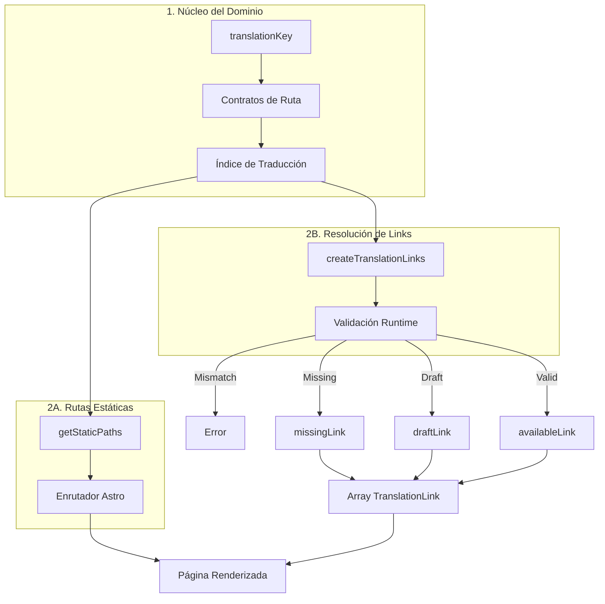

Construí `@secorto/i18n` para eliminar un fallo estructural crónico en sitios estáticos internacionalizados: mezclar la
identidad intrínseca del contenido con las rutas públicas mutables y los slugs de idioma. En arquitecturas comunes, este
acoplamiento genera URLs duplicadas, enlaces huérfanos y bugs de SEO silenciosos como hreflangs rotos.

La librería implementa un enfoque estricto de Diseño Guiado por el Dominio (DDD) al desacoplar tres conceptos que la
industria suele confundir: el significado inmutable del contenido, la URL pública localizada y el recurso traducido.
Al modelar el contenido en torno a un `translationKey` único, el sistema congela la identidad en el núcleo.

## Destruyendo el enrutamiento frágil y los fallos de SEO

En lugar de tratar las rutas localizadas como manipulaciones de strings, `@secorto/i18n` introduce contratos de ruta en
tiempo de compilación. El motor establece Objetos de Valor inmutables para locales, secciones, páginas independientes y
taxonomías asimétricas. Cualquier colisión o slug malformado provoca un aborto inmediato y explícito del build.

Además, el sistema gestiona familias de traducción como matrices unificadas. Cada página estática generada puede consultar
nativamente sus rutas hermanas exactas para alimentar encabezados `hreflang` y selectores de idioma en tiempo real,
asegurando una degradación limpia (estados `missing`) o exclusión de indexación (estados `draft` con noindex).

## El rol de la Inteligencia Artificial en la arquitectura

Siguiendo las políticas de ingeniería establecidas en las ADRs del sitio, este motor de enrutamiento fue diseñado,
desarrollado y auditado exhaustivamente en simbiosis con Inteligencia Artificial. Se utilizaron modelos avanzados no
para generar código genérico, sino para desafiar los límites lógicos de la matriz de traducción.

La IA actuó como un socio arquitectónico, simulando entradas de ruta adversarias, cruzando taxonomías asimétricas
complejas y verificando que las mutaciones de estado en el flujo de enlaces fueran matemáticamente sólidas y libres de
efectos secundarios. Es infraestructura compleja diseñada por intención humana y refinada mediante IA.

Este framework transforma el caótico problema de la navegación multilingüe asimétrica en una arquitectura de dominio
determinista, automatizada y altamente mantenible que escala de forma segura junto al proyecto.
