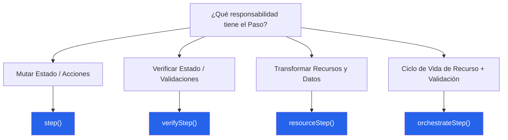

@secorto/step no nació como un elegante ejercicio teórico de arquitectura. Se diseñó a partir de una frustración
sistémica: el tipo exacto de fricción que solo aflora cuando una suite de pruebas E2E crece lo suficiente como para
exponer todas sus grietas.

Durante años, presencié un antipatrón recurrente: los Page Objects inevitablemente mezclaban la intención del dominio
de negocio, los estilos de aserción y las reglas de reporte específicas del framework en funciones monolíticas. Los
tests se llenaron de validaciones ansiosas y acopladas que oscurecían la historia del usuario. Los reportes se volvieron
ruido sin contexto. Las pipelines de CI sufrían por la inestabilidad (flakiness) y la duplicación, mientras que cada
actualización menor del runner amenazaba con romper la suite entera porque la lógica de infraestructura había colonizado
los archivos del dominio.

El diagnóstico siempre era idéntico: **la intención del negocio estaba atada a una mecánica de ejecución inmediata.**

Un script de automatización o un componente de página no debería dictar la propagación de fallos, los límites de los
reportes o el contexto de ejecución de las aserciones de forma independiente. Cuando lo hace, el control se invierte y
la arquitectura de ingeniería colapsa bajo su propio peso.

## La ilusión de las abstracciones de texto semántico

Para salvar la legibilidad, la ingeniería de calidad moderna a menudo recurre a pesadas capas de lenguaje natural, setups
de BDD o motores globales de coincidencia de expresiones. Sin embargo, a escala empresarial, el costo de mantenimiento
de traducir y mapear estas capas de texto intermedias crea un cuello de botella peor que el problema que intenta resolver.

Para evitar esta fricción, los equipos terminan cediendo: reutilizan mecánicas genéricas de bajo nivel (*"hacer click en
el selector X"*, *"escribir en el input Y"*). El lenguaje natural se degrada rápidamente en una traducción incómoda del
código. La suite de automatización deja de hablar el dialecto del negocio y se convierte en esclava del test runner.

Buscando un cambio de paradigma con cero fricción, que preservara el código limpio y el tipado estricto, reevalué el
ciclo de vida de un paso de prueba y me pregunté:

**¿Qué pasaría si la ejecución fuera perezosa (lazy) por defecto?**

- ¿Y si un paso de automatización fuera modelado como una estructura de datos inmutable en lugar de un efecto inmediato?
- ¿And si definiera el significado puro del dominio, aislando por completo el *qué* debe pasar del *cómo* debe fallar?
- ¿Y si la estrategia de ejecución pudiera ser diferida, interceptada y gobernada en el sitio de llamada (call site)?

## Devolviendo la inversión de control al caso de prueba

A partir de esa premisa, desarrollé `@secorto/step`: un modelo de semántica de ejecución agnóstico para automatización.
Arquitectónicamente, el modelo se conecta a la infraestructura de ejecución mediante una estricta Capa de Anti-Corrupción.

En lugar de forzar a los desarrolladores a gestionar complejos DSLs externos o strings mapeados con expresiones
regulares, los pasos se definen de forma nativa en el dominio del componente como artefactos de ejecución diferidos e
inmutables. Al dividir las responsabilidades en cuatro primitivas estructurales —`step()` para acciones, `verifyStep()`
para expectativas, `resourceStep()` para pipelines de datos y `orchestrateStep()` para la sincronización del ciclo de
vida— la base de código se organiza por diseño.

La estrategia de ejecución queda completamente emancipada de la implementación del flujo. Quien consume el test a nivel
de archivo asume el control dinámicamente mediante modificadores fluidos como `.soft()`, `.with(expect)` o `.raw()`,
ajustando los umbrales de fallo a las necesidades del entorno de pruebas actual sin alterar una sola línea de código del
componente.

## El rol de la Inteligencia Artificial en el diseño

Este modelo no solo se construyó para el ecosistema moderno; se diseñó, desarrolló y validó en simbiosis con IA.
Utilicé modelos de lenguaje avanzados no como simples generadores de código, sino como contrapartes arquitectónicas:
copilotos dedicados a desafiar la robustez del modelo de evaluación perezosa y auditar la pureza de las primitivas.

La IA actuó como un validador incansable, simulando escenarios límite (edge cases), ayudando a refinar la API de cuatro
funciones hasta su estado más puro y garantizando que la inmutabilidad de los artefactos fuera matemáticamente sólida
antes de escribir la primera línea de TypeScript. Es un producto diseñado por ingeniería humana, potenciado y refinado
quirúrgicamente a través de Inteligencia Artificial.

La arquitectura de QA resultante entrega una estabilidad medible:

- **Los tests articulan historias de producto humanas** sin el impuesto de mantenimiento de las librerías de traducción.
- **Las estructuras de reporte se vuelven altamente semánticas**, ordenando el ruido técnico en hitos de negocio claros.
- **Los entornos de CI ganan una flexibilidad táctica incomparable**, permitiendo cambiar entre ejecuciones estrictas o
  tolerancias suaves sin esfuerzo.

`@secorto/step` eleva la automatización de pruebas de una colección suelta de scripts ansiosos a un ecosistema de
software disciplinado y robusto. Es una respuesta de ingeniería elegante a un fallo de diseño que la industria tolera
históricamente, pero rara vez soluciona desde la raíz.
