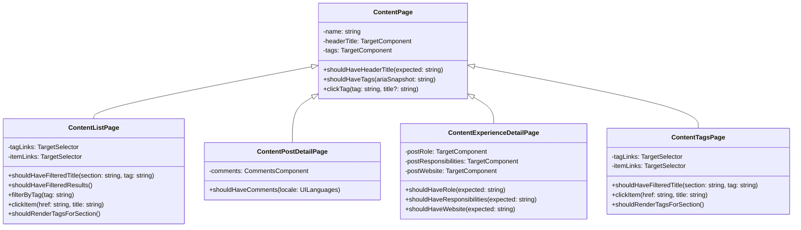

# Arquitectura de Page Objects de Contenido

## Diagrama de Clases

## Separación de Responsabilidades

_Nota: Los métodos `shouldHaveHeaderTitle()` y `shouldHaveTags()` son comunes a todas las clases (heredados de `ContentPage`)._

| Responsabilidad | ContentListPage | ContentPostDetailPage | ContentExperienceDetailPage | ContentTagsPage |
| :-- | :-: | :-: | :-: | :-: |
| Mostrar lista de items | ✅ | ❌ | ❌ | ❌ |
| Filtrar por tags | ✅ | ❌ | ❌ | ✅ |
| Navegar a items | ✅ | ❌ | ❌ | ✅ |
| Mostrar detalles del item | ❌ | ✅ | ✅ | ❌ |
| Mostrar comentarios | ❌ | ✅ | ❌ | ❌ |
| Mostrar role/experiencia | ❌ | ❌ | ✅ | ❌ |
| Mostrar links externos | ❌ | ❌ | ✅ | ❌ |

## Implementación

Las implementaciones de cada Page Object y sus factories están en [tests/support/ui/content/](../../tests/support/ui/content/):

- **Base compartida**: [ContentPage.ts](../../tests/support/ui/content/ContentPage.ts) — propiedades y métodos comunes
- **Listas**: [ContentListPage.ts](../../tests/support/ui/content/ContentListPage.ts),
  [BlogPages.ts](../../tests/support/ui/content/BlogPages.ts),
  [WorkPages.ts](../../tests/support/ui/content/WorkPages.ts), etc.
- **Detalles de Posts**:
  [ContentPostDetailPage.ts](../../tests/support/ui/content/ContentPostDetailPage.ts)
- **Detalles de Experiencia**:
  [ContentExperienceDetailPage.ts](../../tests/support/ui/content/ContentExperienceDetailPage.ts)
- **Filtros por Tags**: [ContentTagsPage.ts](../../tests/support/ui/content/ContentTagsPage.ts)

### Patrón de Instanciación

Cada Page Object se instancia a través de una factory function que:

1. Crea la base común (`ContentPage`) con selectores de encabezado y tags
2. Agrega selectores y componentes específicos del Page Object
3. Retorna una instancia completamente tipada

Esta separación mantiene selectores centralizados y facilita refactorización sin duplicación.

### Detalles de Uso

Cada método de los Page Objects incluye JSDoc con descripción, parámetros y comportamiento esperado. Ver los archivos específicos para detalles de qué hace cada método:

- [ContentPage.ts](../../tests/support/ui/content/ContentPage.ts) — métodos comunes (`shouldHaveHeaderTitle`, `shouldHaveTags`, `clickTag`)
- [ContentListPage.ts](../../tests/support/ui/content/ContentListPage.ts) —
  navegación y filtrado por tags
- [ContentPostDetailPage.ts](../../tests/support/ui/content/ContentPostDetailPage.ts) —
  validación de comentarios
- [ContentExperienceDetailPage.ts](../../tests/support/ui/content/ContentExperienceDetailPage.ts) —
  validación de metadata profesional
- [ContentTagsPage.ts](../../tests/support/ui/content/ContentTagsPage.ts) —
  filtrado y navegación por tags

## Beneficios

🎯 **Claridad**

- Nombre de clase comunica su propósito
- Métodos disponibles son evidentes

🔒 **Type Safety**

- TypeScript previene usar método incorrecto
- IDE autocompletar es preciso

📚 **Mantenibilidad**

- Cambios en lista no afectan detalle
- Fácil agregar nuevos comportamientos

🏗️ **Escalabilidad**

- Patrón replicable en otros Page Objects
- Preparado para refactorización futura

✅ **Testing**

- Tests más descriptivos y enfocados
- Menos confusión sobre qué está siendo probado
