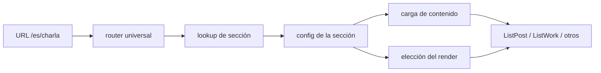
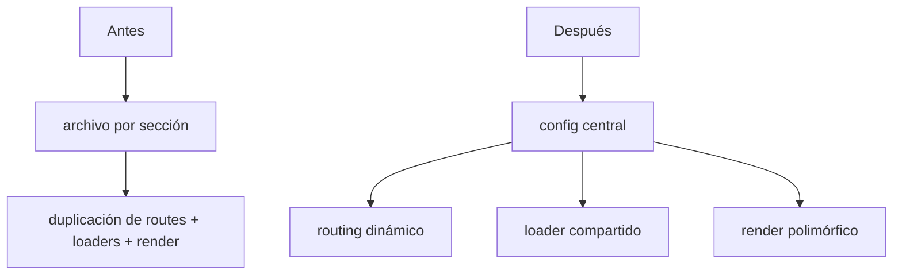

# Diagrama de arquitectura

> Este anexo es una vista ejecutiva de la arquitectura de la refactorización. Su objetivo
> es resumir la idea central sin repetir la explicación detallada de los otros documentos.

## Resumen ejecutivo

La refactorización buscó centralizar la definición de cada sección para evitar la duplicación
que existía en rutas, carga y render de cada colección.

## Qué cambia en la práctica

Antes, cada sección tenía su propia página y repetía la misma lógica. Después, el sistema
resuelve la lógica desde una configuración central y un renderer genérico.

## Regla de diseño

La idea clave es esta:

- una sección está descrita en un único punto
- el router decide según la URL
- el loader obtiene los datos según esa configuración
- el renderer adapta la salida según el tipo de contenido

Es un patrón de diseño basado en metadata y composición, no en múltiples rutas hardcodeadas.

## Qué no es este documento

No es una guía de implementación actual ni un inventory de módulos. Para eso ya existen:

- [ARCHITECTURE_SECTIONS.md](./ARCHITECTURE_SECTIONS.md)
- [BEFORE_AFTER_COMPARISON.md](./BEFORE_AFTER_COMPARISON.md)

Este archivo solo aporta una vista visual rápida del patrón que motivó la refactorización.
