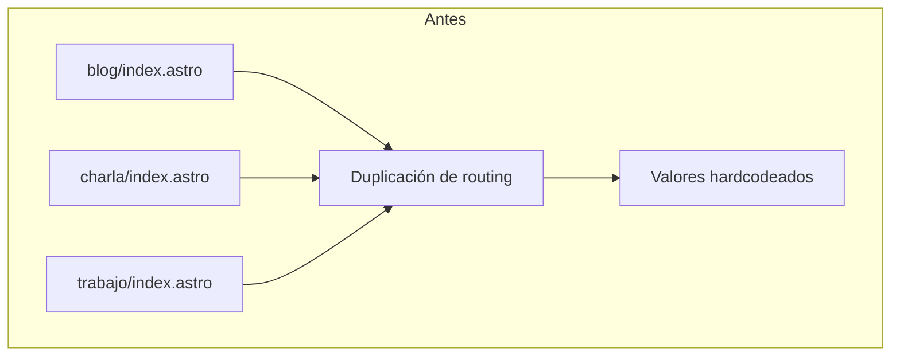
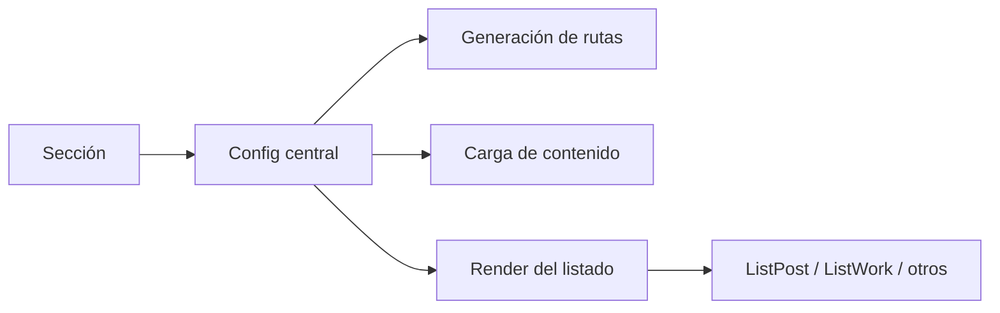
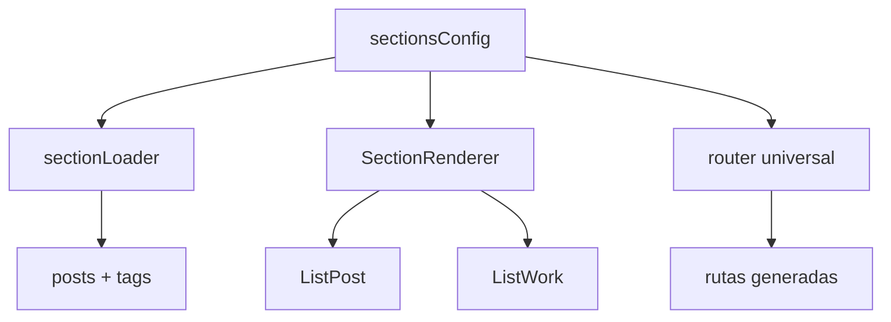

# Arquitectura de secciones - sistema polimórfico

> Este documento es un anexo de evolución y diseño. Sirve para explicar la transición
> de la duplicación inicial hacia un sistema basado en configuración y generación
> dinámica. No es la fuente de verdad del estado actual del código; es una explicación
> útil del patrón que motivó la migración y que aún conserva valor conceptual.

## Contexto

Antes de la refactorización, los listados de contenido repetían casi la misma lógica en
archivos distintos por sección, por ejemplo:

- `blog/index.astro`
- `charla/index.astro`
- `trabajo/index.astro`

Cada archivo tenía la misma estructura:

- carga de la colección
- generación de la lista de posts
- cálculo de tags
- render del componente de listado
- rutas y traducciones hardcodeadas

La relación entre esos archivos se puede resumir así:



## Qué se resolvió

La solución centralizó la descripción de cada sección en un registro compartido,
permitiendo que la app pudiera tratar todas las secciones con el mismo patrón sin
repetir la lógica de enrutado, carga y render.



## Patrón que quedó vigente

La idea útil que sí siguió siendo válida es esta:

1. cada sección se describe en un único punto
2. la ruta y el tipo de render se resuelven desde esa configuración
3. la lógica compartida responde a la metadata, no a una serie de `if` por archivo

Esto es lo que se entiende por diseño polimórfico: una misma plantilla general se adapta
según los datos de la sección.

## Estructura conceptual de la solución



## Ejemplo de configuración

```typescript
export const sectionsConfig: Record<SectionType, SectionConfig> = {
  blog: {
    collection: 'blog',
    translationKey: 'nav.blog',
    hasTags: true,
    routes: { es: 'blog', en: 'blog' },
    listComponent: 'ListPost',
    showFeaturedImage: true
  },
  talk: {
    collection: 'talk',
    translationKey: 'nav.talks',
    hasTags: true,
    routes: { es: 'charla', en: 'talk' },
    listComponent: 'ListPost',
    showFeaturedImage: true
  }
}
```

Esto permite:

- alias por idioma (`charla` en español, `talk` en inglés)
- cambios en un único punto
- validación por TypeScript
- crecimiento sin duplicación de archivos

## Beneficios del enfoque

| Aspecto | Antes | Después |
| --- | --- | --- |
| Duplicación | Alta | Baja / centralizada |
| Cambio de alias | Múltiples archivos | Un único punto |
| Agregar sección | Crear más rutas y archivos | Añadir entrada en la config |
| Mantenimiento | Fragmentado | Centralizado |
| Complejidad | Crece con cada sección | Se mantiene por patrón |

## Qué no debe tomarse como verdad absoluta

La implementación actual ya no se reduce exactamente a ese esquema original. El proyecto
ha evolucionado hacia una librería reutilizable `@secorto/i18n` y a un modelo donde la
indexación, las rutas y la traducción se resuelven con funciones compartidas.

Por eso, este documento debe tratarse como:

- una explicación de la idea que motivó la refactorización
- un anexo de diseño y evolución
- no como la descripción canónica del estado actual del código

## Conclusión

La arquitectura de secciones es una pieza muy útil para entender la transición de un
sistema repetitivo a uno basado en configuración. Es un documento con valor arquitectónico,
pero no es un “snapshot final” del código actual.

El punto más importante es que la idea que sigue siendo válida es la centralización del
conocimiento de cada sección y la generación dinámica de rutas y render a partir de esa
metadata.
