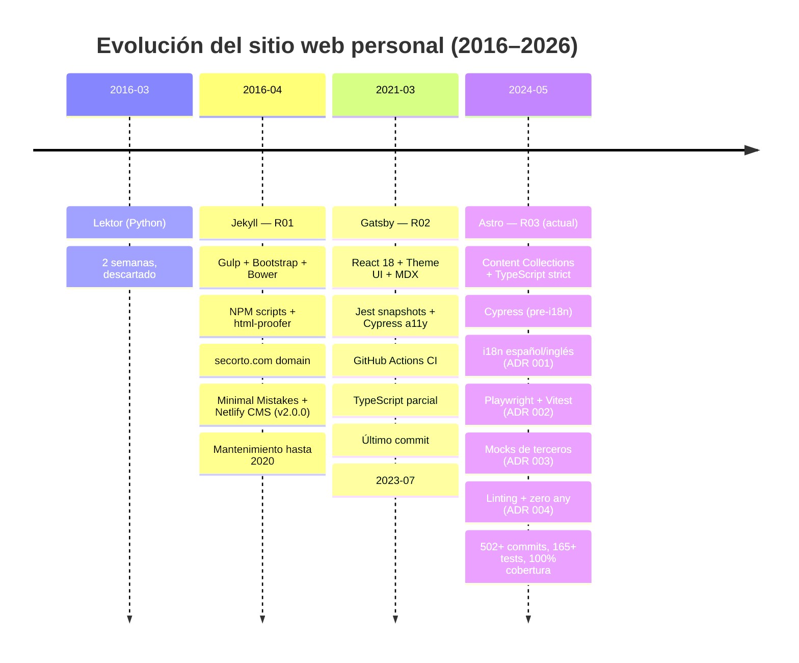

# R03 — Métricas del repositorio

| Métrica | Valor |
| --- | --- |
| Commits totales | 502+ |
| Período activo | 2024-05 a presente |
| Colecciones de contenido | 5 (blog, talk, work, projects, community) |
| Idiomas | 2 (es, en) |
| Tests unitarios | 165+ (100% cobertura) |
| Tests E2E | Suite completa (Chromium, Firefox, WebKit) |
| ADRs | 5 formales + 3 retrospectivos |
| CI jobs | 2 paralelos (unit + E2E) |

## Línea temporal completa del proyecto

