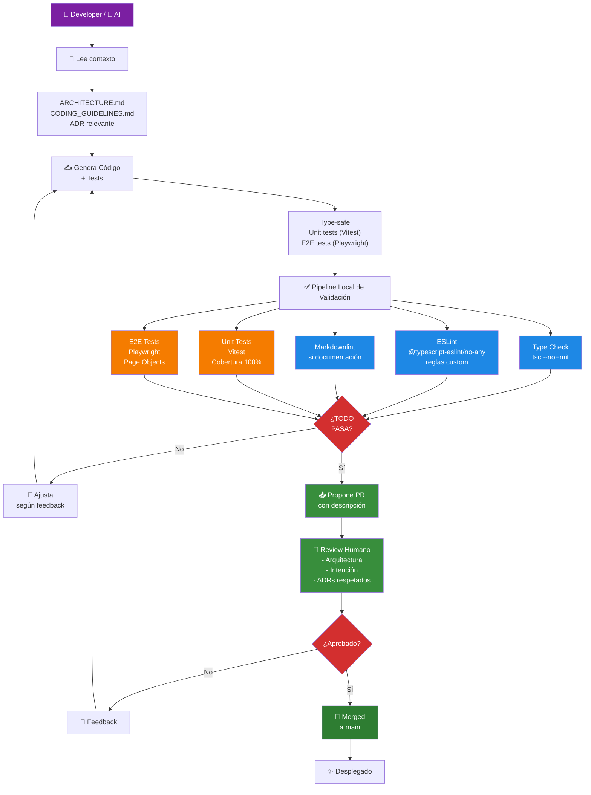

# Development Workflow — Quality by Design en Acción

Este documento visualiza cómo el workflow de desarrollo implementa los 3 principios de **Quality by Design**:

1. **Separación de Responsabilidades** → Capas de tests (unit/component/page/flow)
2. **DRY** → Validación centralizada, una fuente de verdad
3. **Type Safety & Determinismo** → Type checking + Linting como primera línea

---

## 🔄 Pipeline de Desarrollo Completo



**Legenda:**
- 🔵 **Type Check + Linting** (azul) — Validación **estática** (sin ejecutar código)
- 🟠 **Unit + E2E Tests** (naranja) — Validación **dinámica** (ejecutable)
- 🟣 **Inicio** (púrpura) — Dev o IA
- 🟢 **Review + Merge** (verde) — Humano

---

## 📊 Cómo Valida Cada Principio

### 1️⃣ Separación de Responsabilidades

| Validación | Herramienta | Qué Verifica |
|---|---|---|
| **Lógica pura en `src/domain/`** | Vitest (unit) | Domain logic 100% testeable sin dependencias de framework |
| **Componentes puros** | Vitest (component) | Props tipadas, renderizado consistente |
| **Navegación/rutas** | Playwright (page) | Rutas dinámicas, parámetros, redirecciones |
| **Flujos usuario** | Playwright (flow) | Caso de uso completo: login → búsqueda → detalle → traducción |

**Resultado:** Si tests pasan, responsabilidades están correctamente separadas.

---

### 2️⃣ DRY (Una Fuente de Verdad)

| Validación | Herramienta | Qué Verifica |
|---|---|---|
| **Imports centralizados** | TypeScript `tsconfig.paths` + ESLint | Path aliases (`@/domain`, `@/components`, etc.) evitan duplicación |
| **Configuración centralizada** | `src/content.config.ts` + Vitest | Rutas dinámicas, tipos, validación compartida |
| **Tipos únicos** | `tsc --noEmit` + ESLint | `TranslationKey`, `SectionType` validados en build + tests |
| **Lógica duplicada** | ESLint custom rules + revisión | No repetir funciones; extraer a `src/domain/` |

**Resultado:** Cambio en un lugar = se refleja automáticamente en código y tests.

---

### 3️⃣ Type Safety & Determinismo

| Validación | Herramienta | Qué Verifica |
|---|---|---|
| **Tipos explícitos** | `@typescript-eslint/no-explicit-any: error` | Prohibido `any`; tipos concretos obligatorios |
| **Build-time validation** | `astro check` + `tsc --strict` | Tipos inválidos fallan antes de tests |
| **Runtime determinismo** | Playwright (E2E) | Entrada determinística → Output determinístico (sin race conditions) |
| **Comportamiento predecible** | Vitest snapshots (si aplica) | Output consistente bajo mismas condiciones |

**Resultado:** Errores = detectados en compile-time (rápido), no en producción.

---

## 🛠️ Comandos de Validación Local

Antes de proponer PR, ejecuta en este orden:

```bash
npm run build      # Type checking + build
npm run lint       # Linting (tipos, estilo, markdown)
npm run test:unit  # Unit tests (cobertura 100%)
npm run test:e2e   # E2E tests (flujos completos)

# Atajo: todo junto (como CI)
npm run test
```

**Documentación completa de cada herramienta:** Ver [TESTING_STRATEGY.md](./TESTING_STRATEGY.md)

---

## 📌 Checklist Antes de PR

- [ ] Leí [ARCHITECTURE.md](../ARCHITECTURE.md) — entiendo los 3 principios
- [ ] Leí ADR relevante (`adr/`) — entiendo decisiones previas
- [ ] Seguí [CODING_GUIDELINES.md](../CODING_GUIDELINES.md) — estilo + type safety
- [ ] Ejecuté pipeline completo: `npm run build && npm run lint && npm run test:unit && npm run test:e2e`
- [ ] Todos los tests pasan localmente — mismo que en CI
- [ ] PR tiene descripción clara (qué, por qué, referencias a ADRs)

---

## 🤖 Para AI (Copilot/Claude)

El flujo anterior es tu workflow:

1. **Antes de generar:** Lee contexto (ARCHITECTURE.md, ADR relevante)
2. **Mientras generas:** Type-safe TypeScript + tests en la misma sesión
3. **Después de generar:** Ejecuta validaciones locales (`npm run lint`, `npm run test:*`)
4. **Propón PR:** Si todo pasa, propón con descripción clara

**Instrucciones completas:** [.github/copilot-instructions.md](../../.github/copilot-instructions.md)

---

## 🔗 Referencias

- [ARCHITECTURE.md](../ARCHITECTURE.md) — Principios transversales
- [TESTING_STRATEGY.md](./TESTING_STRATEGY.md) — Detalles de cada tipo de test
- [PAGE_OBJECTS.md](./PAGE_OBJECTS.md) — Patrón E2E (Page Object Model)
- [CODING_GUIDELINES.md](../CODING_GUIDELINES.md) — Reglas de código
- [adr/](../adr/) — Decisiones que sustentan este workflow
- [.github/copilot-instructions.md](../../.github/copilot-instructions.md) — Instrucciones para AI
