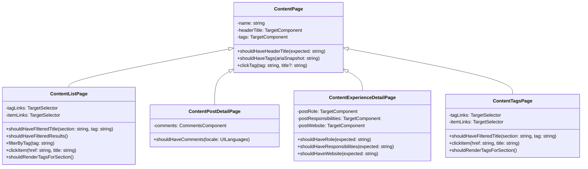

# Page Objects: Arquitectura E2E Basada en Flows Observables

Modelo de arquitectura para estructurar tests E2E donde **todo es Flow composable**.

## Principio Fundamental

**Flows son la unidad de composición obligatoria, no opcional.** Cada pieza de conocimiento (Component, Page, Test) se estructura como Flow que materializa Steps observables en reportes.

### Por Qué

- **Observabilidad**: Solo Steps aparecen en reportes. Flows organizan el conocimiento; Steps comunican intent.
- **Reusabilidad**: Flows se reutilizan sin duplicación. Evita generar múltiples tests pequeños.
- **MTTR**: Reportes legibles = diagnóstico rápido = menos tiempo de reparación.
- **ADR 015**: Soft asserts agrupan fallos relacionados en UN flow, no 20 tests dispersos.

## Modelo Genérico: Component/Page/Flow

La arquitectura E2E en este proyecto sigue un modelo de **composición basada en Flows**:

### Capa 1: Components (Unidades de UI con Comportamiento)

**Ubicación**: `tests/support/ui/components/`

Abstraen cualquier unidad de UI con un protocolo de interacción o validación esperado:

- **Primitivos**: `Target` (locator genérico + assertions), `Link` (locator + validaciones de href)
- **Especializados**: `Comments` (composite: script + iframe), `PageHelper` (utilidades stateless)
- **Criterio de creación**: ¿Tiene el elemento un "happy path" o protocolo de uso? → Es componente
- **Responsabilidad**: Encapsular cómo se ve/comporta EL ELEMENTO específico (no el contexto page)
- **Patrón**: Clase + factory + métodos que retornan `Promise` vía `step()`
- **Realidad SSG**: En un sitio sin interacciones pesadas, `Target` suele ser
  suficiente. Pero si existe un Dropdown, Modal, o Tab con open/close/select,
  ese es un componente formal

### Capa 2: Pages (Orquestadores de Components)

**Ubicación**: `tests/support/ui/{domain}/` (ej: `home/`, `content/`, `sidebar/`)

Orquestan múltiples components con métodos semánticos que representan el flujo local:

- **Responsabilidad**: Combinar components para expresar la lógica/validación de una sección
- **Patrón**:
  - Clase con constructor que inyecta components
  - Factory: `homePage(page: Page): HomePage`
  - Helper: `userInHome(page: Page): Promise<HomePage>` que invoca `visit()` y retorna factory
  - Métodos sin `async` si retornan lazy `Promise` (para encadenamiento)
- **Métodos**: Cada uno encapsulado en `step()`, orquestan 1+ componentes + lógica local
- **Exportación**: Cada Page Object expone métodos semánticos, NO simples locators

### Capa 3: Flows (Composición Observable de Pasos - OBLIGATORIO)

**Ubicación**: `tests/support/ui/seo/`, `tests/support/ui/content/flows/`, etc.

Encapsulan narrativas o validaciones que se ejecutan como Flows materializados en Steps observables.

- **Responsabilidad**: Encapsular una unidad semántica de conocimiento (validación, navegación, interacción)
- **Obligatorio**: Todo siempre debe ser Flow. Flujos pequeños (una validación) o grandes (multi-page)
- **Patrón**:
  - Función que retorna `verifyStep()` o `step()` 
  - Cada Flow es composable y reutilizable
  - Flows pueden componer otros Flows
- **Cuándo**: SIEMPRE. Una validación aislada es un Flow. Una secuencia multi-page es un Flow. Un grupo de validaciones relacionadas es UN Flow con multiple `.soft()`
- **Razón**: Previene generación de múltiples tests pequeños (antipatrón). Produce reportes observables y legibles.
- **Ejemplos**:
  - `shouldHaveTitleTag()` — Flow de validación individual
  - `shouldRenderSeoCorrectly()` — Meta-Flow que compone otros Flows
  - `userInBlogList()` — Flow de navegación + setup

## Patrones y Principios

- **Componentes vs Pages**: Components encapsulan comportamiento de elementos aislados
  (Target, Dropdown, Comments). Pages combinan components para expresar lógica de sección/dominio.
  Pages exponen métodos semánticos, NO simples locators.
- **Encapsulación en `step()`**: Cada método retorna `Promise` via `step()` para visibilidad en reportes E2E.
- **Inyección de componentes**: Pages reciben components en constructor, no los crean directamente.
- **Flows son obligatorios**: Toda validación, interacción o navegación debe ser un Flow nomFo.
  Previene tests dispersos y asegura observabilidad en reportes.
- **Soft asserts para agrupar fallos**: Cuando múltiples validaciones relacionadas fallan, usan `.soft()`
  dentro de UN Flow para reportar todo junto sin detener.  
  Ver [ADR 015: Consolidated E2E Assertions](../adr/015-consolidated-e2e-assertions-soft-expect.md).
- **Localizadores estables**: Preferir selectores accesibles por Playwright (`getByRole` / ARIA).
  Si no es práctico, usar `data-testid` como atributo estable. Evitar selectores frágiles (clases).
- **Mocking de terceros**: Mockear recursos externos con `page.route()` o proveedores locales en CI.
- **Timeouts razonables**: Usar checks de visibilidad/atributos en lugar de `sleep()`
- **Composición sobre herencia**: Prefiere inyectar components en pages que crear jerarquías de herencia.

## Anti-Patterns a Evitar

### ❌ Steps Inlined sin Flows Nombrados

```typescript
// MAL: Steps sueltos sin Flow nombrado
return verifyStep('SEO metadata is rendered correctly', async ({ expect }) => {
  const title = await page.locator('head title').textContent()
  expect(title).toContain('SeCOrTo')
  // ... 50 más líneas inline aquí
})
```

### ✅ CORRECTO: Flows Nombrados Compuestos

```typescript
// BIEN: Flows individuales reutilizables
export function shouldHaveTitleTag(page: Page) {
  return verifyStep('title tag is correct with branding', async ({ expect }) => {
    const title = await page.locator('head title').textContent()
    expect(title, 'title should contain SeCOrTo').toContain('SeCOrTo')
  })
}

// BIEN: Meta-Flow que compone otros Flows
export function shouldRenderSeoCorrectly(page: Page, locale: UILanguages) {
  return verifyStep('SEO metadata is rendered correctly', async ({ expect }) => {
    await shouldHaveTitleTag(page).with(expect).soft()
    await shouldHaveMetaDescription(page).with(expect).soft()
    // ... más Flows
  })
}
```

### ❌ Múltiples Tests Pequeños Dispersos

```typescript
// MAL: 20 tests individuales, cada uno cargando la página
test('should have title tag', async ({ page }) => { ... })
test('should have meta description', async ({ page }) => { ... })
test('should have canonical link', async ({ page }) => { ... })
// ... 17 tests más
```

### ✅ CORRECTO: Un Test que Compone Flows con Soft Asserts

```typescript
// BIEN: Un test, múltiples Flows con soft asserts
test(`Homepage SEO (${locale})`, async ({ page }) => {
  await visit('user navigates to homepage', page, homePath(locale), () => ({}))
  await shouldRenderSeoCorrectly(page, locale)
})
```

**Ventajas**:
- Una sola carga de página
- Reporte legible y observable
- Si un Flow falla, continúan los demás (soft asserts)
- Diagnóstico claro: "estos 3 Flows fallaron en este test"

---

## Ejemplo: Modelo de Page Objects para Content

Aplicación concreta del modelo genérico al testing de contenido (blogs, talks, trabajos, etc.).

**Para el contexto de decisión, justificación y tabla de responsabilidades**, ver [ADR 014: Jerarquía de Page Objects](../adr/014-page-objects-hierarchy-separation-of-concerns.md).

### Diagrama de Clases



### Archivos de Implementación

Las implementaciones de cada Page Object y sus factories están en [tests/support/ui/content/](../../tests/support/ui/content/):

- **Base compartida**: [ContentPage.ts](../../tests/support/ui/content/ContentPage.ts)
- **Listas**: [ContentListPage.ts](../../tests/support/ui/content/ContentListPage.ts), [BlogPages.ts](../../tests/support/ui/content/BlogPages.ts), [WorkPages.ts](../../tests/support/ui/content/WorkPages.ts), etc.
- **Detalles**: [ContentPostDetailPage.ts](../../tests/support/ui/content/ContentPostDetailPage.ts), [ContentExperienceDetailPage.ts](../../tests/support/ui/content/ContentExperienceDetailPage.ts)
- **Filtrado**: [ContentTagsPage.ts](../../tests/support/ui/content/ContentTagsPage.ts)
