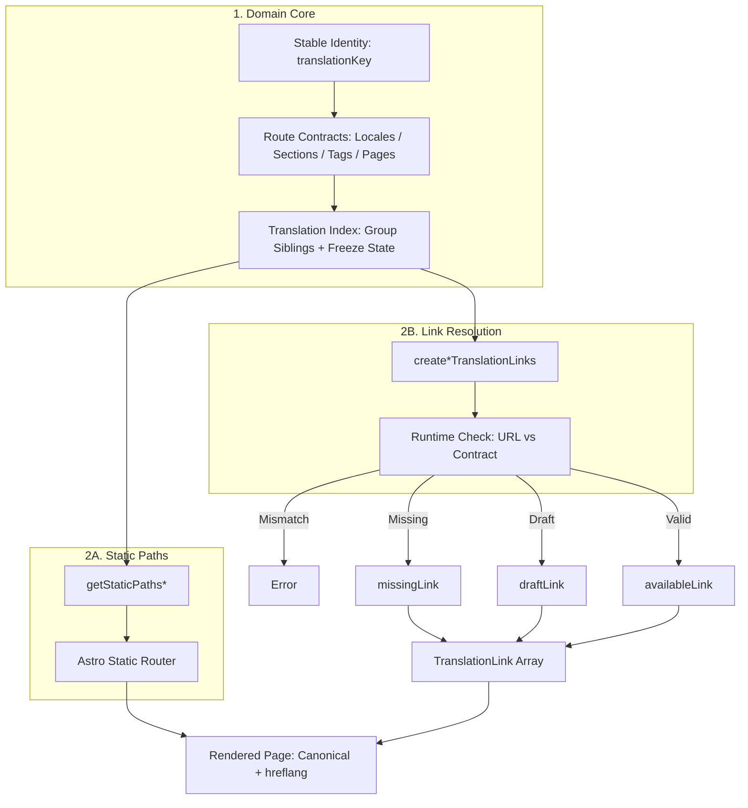

# @secorto/i18n

Framework-agnostic primitives for highly asymmetric multilingual content systems.

## Why this exists: Identity vs. Routing

Most i18n issues are not really translation issues; they are **identity and consistency issues**.

When a site grows, slugs, locale prefixes, content IDs, and localized strings start mixing together.
This creates brittle navigation, ambiguous content relationships, and silent SEO bugs (like broken `hreflang` targets).

`@secorto/i18n` separates those concerns. The package models localized content around a stable,
unique `translationKey` instead of a mutable slug or resource ID.

```ts
export interface LocalizedEntry<TSection, TEntry, TLocale> {
  section: TSection
  cleanId: string
  translationKey: string
  locale: TLocale
  draft: boolean
  original: TEntry
}
```

This keeps the identity of the content distinct from the identity of the URL or resource ID.
The same content can exist across highly asymmetric locales while still being resolved as a single,
unified translation unit.

---

## High-Level Translation Flow

The concept is declarative: each content item is first identified by its meaning (`translationKey`),
then the system indexes and groups them by locale, generates asymmetric paths,
and finally compiles safe metadata links for SEO and navigation.



### In practice, this architectural model ensures

* **Translation Families:** Source content is stored per locale but evaluated as a single logical unit.
* **Deterministic Links:** Every page can instantly ask
  *"what are the exact sibling paths of this item?"* to feed language selectors
  or `hreflang` headers without recalculating path rules.
* **Graceful Degradation (`missing` states):** If a language variant doesn't exist yet,
the system still computes its potential path but flags it as unavailable.
* **Native Draft Lifecycle (`draft` states):** Translations marked as drafts
remain part of the logical group to maintain navigation boundaries but are automatically
hidden from canonical SEO indexing (`noindex`).

---

## 1. Domain Configuration (The Invariant Contracts)

The library exposes immutable Value Objects for locales, sections, standalone pages, and tag routes.
These enforce strict constraints at construction time, ensuring **zero slug collisions**
and failing fast (throwing explicit errors) during development or build time
if empty or duplicated `(locale, slug)` pairs occur.

Configure your single source of truth (e.g., `src/domain/i18n.ts`):

```ts
import { createLocales, createSectionRoutes, createStandalonePageRoutes, createTagRoutes } from '@secorto/i18n'

// 1. Define supported locales
export const languages = createLocales(['en', 'es'])

// 2. Map localized section slugs to content collections
export const sectionRoutes = createSectionRoutes(
  {
    blog: { en: 'blog', es: 'bitacora' },
  },
  languages,
)

// 3. Map fixed static page slugs (Strict Path Contract)
export const standalonePageRoutes = createStandalonePageRoutes(
  {
    about: {
      en: { slug: 'about' },
      es: { slug: 'acerca-de' },
    },
  },
  languages,
)

// 4. Map localized taxonomy slugs (Locale x Section x Tag)
export const tagRoutes = createTagRoutes(
  sectionRoutes,
  { en: 'tags', es: 'tags' },
  {
    dev: { en: 'dev', es: 'desarrollo' },
    opensource: { en: 'opensource', es: 'codigo-abierto' },
  },
  languages,
)
```

---

## 2. Main Content Flow (Collections & Entries)

In this framework, **each `section` maps directly to an Astro Content Collection**,
while an **`entry` represents the localized resource bundle** bound to its core identity index.

### Section Index View (`/[locale]/[section]/index.astro`)

The `getStaticPathsSections` helper handles root path initialization.
Filter your content collections declaratively using `availableAtLocale` to isolate data segments cleanly.

```astro
---
import { getCollection } from 'astro:content'
import { getStaticPathsSections, availableAtLocale, availableLink } from '@secorto/i18n'
import { languages, sectionRoutes, tagRoutes } from '@domain/i18n'

export async function getStaticPaths() {
  return await getStaticPathsSections(sectionRoutes, languages)
}

const { locale } = Astro.params
const { section } = Astro.props

const posts = await getCollection(section, availableAtLocale(locale))
const links = languages.all.map(lang =>
  availableLink(sectionRoutes.getSectionPath(section, lang), lang)
)
const activeTags = tagRoutes.getTags().filter(tag =>
  posts.some(post => post.data.tags.includes(tag)),
)
---
<html>
  <head>
    {links.map(({ url, locale }) => <link rel="alternate" hreflang={locale} href={url} />)}
  </head>
  <body>
    <nav>
      {activeTags.map(tag => <a href={tagRoutes.getSectionTagPath(section, locale, tag)}>{tag}</a>)}
    </nav>
    <main>
      {posts.map(post => <h2>{post.data.title}</h2>)}
    </main>
  </body>
</html>
```

### Entry Detail View (`/[locale]/[section]/[slug].astro`)

The `getStaticPathsEntries` utility indexes structural assets via `createTranslationIndex()`,
groups siblings by core identity, and exposes cross-linked alternate arrays directly into page properties.

```astro
---
import { render, getCollection } from 'astro:content'
import { getStaticPathsEntries, createDetailTranslationLinks } from '@secorto/i18n'
import { languages, sectionRoutes } from '@domain/i18n'

export async function getStaticPaths() {
  return await getStaticPathsEntries(sectionRoutes, getCollection, languages)
}

const { locale } = Astro.params
const { entry, siblings, section } = Astro.props

const links = createDetailTranslationLinks(siblings, sectionRoutes, languages)
const { Content } = await render(entry.original)
---
<html>
  <head>
    {entry.draft && <meta name="robots" content="noindex" />}
    {links.map(({ url, locale }) => <link rel="alternate" hreflang={locale} href={url} />)}
  </head>
  <body>
    {entry.draft && <div role="status">Draft Notice: This translation variant is a preliminary work.</div>}
    <article>
      <Content />
    </article>
  </body>
</html>
```

---

## 3. Advanced Ecosystem: Asymmetric Tag Routing

`createTagRoutes` acts as a dedicated navigation and classification layer.
The `getStaticPathsSectionTags` helper processes tag intersections natively,
avoiding empty route compilation by inspecting active datasets on the fly.

```astro
---
import { getCollection } from 'astro:content'
import { getStaticPathsSectionTags, createSectionTagTranslationLinks, availableAtLocale, withTag } from '@secorto/i18n'
import { languages, sectionRoutes, tagRoutes } from '@domain/i18n'

export async function getStaticPaths() {
  return getStaticPathsSectionTags(languages, sectionRoutes, tagRoutes, (sec) => getCollection(sec))
}

const { locale } = Astro.params
const { section, tag, siblings } = Astro.props

const tagSlug = tagRoutes.getTagSlug(tag, locale) // Resolves "codigo-abierto" or "opensource" dynamically
const links = createSectionTagTranslationLinks(languages.all, siblings, section, tag, tagRoutes)
const posts = await getCollection(section, availableAtLocale(locale))
const postWithTag = posts.filter(withTag(tag))
---
<html>
  <head>
    {links.map(({ url, locale }) => <link rel="alternate" hreflang={locale} href={url} />)}
  </head>
  <body>
    <h1>Tag: {tagSlug}</h1>
    {postWithTag.map(post => <h3>{post.data.title}</h3>)}
  </body>
</html>
```

*(Note: The package also provides `getEntriesBySection` and `getSectionsWithTagContent` primitives to
effortlessly create global taxonomy indexes like `/[locale]/tags/index.astro`,
generating real-time item metrics and filtering empty terms out of layout loops).*

---

## 4. Advanced Ecosystem: Strict Standalone Pages

For standalone static layout paths (e.g., `/about` or `/privacy`),
the library bypasses filesystem guesswork entirely. It checks the live runtime `pathname` against your contract layer.
If a static asset introduces an unindexed key, the application context aborts instantly to prevent orphan routing anomalies.

```astro
---
import type { MarkdownLayoutProps } from 'astro'
import { createStandalonePageLinks } from '@secorto/i18n'
import { languages, standalonePageRoutes } from '@domain/i18n'

type Props = MarkdownLayoutProps<{ title: string; translationKey: string }>
const { frontmatter } = Astro.props
const { title, translationKey } = frontmatter

const path = Astro.url.pathname.slice(1).replace(/\/$/, '')

// Will crash early if the translationKey or route setup violates the domain contract
const links = createStandalonePageLinks(path, translationKey, standalonePageRoutes, languages)

const locale = languages.fromString(Astro.currentLocale)
const page = standalonePageRoutes.getPage(translationKey)
const draft = standalonePageRoutes.routes[page][locale]?.draft ?? false
---
<html>
  <head>
    <title>{title}</title>
    {draft && <meta name="robots" content="noindex" />}
    {links.map(({ url, locale }) => <link rel="alternate" hreflang={locale} href={url} />)}
  </head>
  <body>
    <main>
      <slot />
    </main>
  </body>
</html>
```

---

## Installation

```bash
npm install @secorto/i18n
```

## License

MIT
