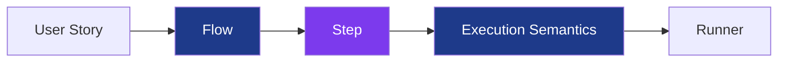
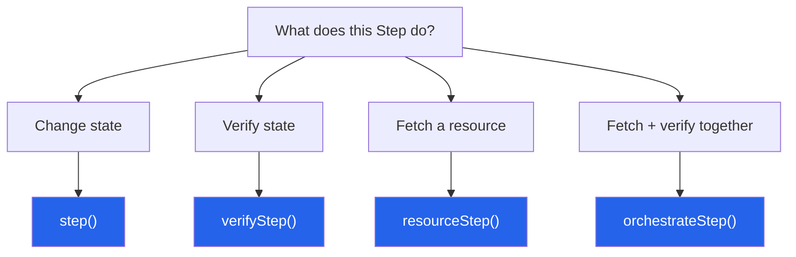

# @secorto/step

As your E2E suite grows, the same pressure surfaces in most teams: the tests still pass locally,
the reports are still readable — but the flows are getting harder to change.

The root cause is usually this: the flow that describes what the user does also manages
how that work runs — whether it's strict or soft, which assertion engine applies,
whether a failure stops the suite or continues. Change the policy, change the flow.

`@secorto/step` separates those two things.

---

## Core Concepts



- **User Story** — the trigger. A plain-language description of what the user does:
  *"User submits login form"*, *"User navigates to checkout"*. Not a framework concept —
  just the requirement that gives the flow its name and its reason to exist.
- **Flow** — a plain JavaScript function that returns a step.
- **Step** — a named action. What the flow returns, what the runner executes, what appears in the report.
- **Execution Semantics** — how you call the step: `await`, `.soft()`, `.with()`, `.raw()`.
  The flow doesn't change. The caller decides.
- **Runner** — the test framework executing the step. Injected via adapter, never imported directly.

---

## ⚙️ Execution Semantics

| Modifier | What it does |
|---|---|
| *(None)* | Strict (default) — stops on first failure |
| `.soft()` | Continues running after a failure; appends `(soft)` to the report label |
| `.with(expect)` | Replaces the assertion engine at the call site |
| `.raw()` | Skips transformation, returns the original resource |

The flow never changes. The caller chooses the strategy.

```
✓ homepage main components are loaded (soft) (98ms)
  ✓ avatar is visible
  ✗ bio text is visible
```

That `(soft)` label didn't come from inside the flow. It came from the call site.

```ts
await home.shouldBeLoaded()        // strict
await home.shouldBeLoaded().soft() // soft — six extra chars
```

Why not just put `expect.soft` inside the method? Because then the method owns that decision —
and the next test that needs strict behavior either duplicates the flow or works around it.
Keeping the policy at the call site means the flow stays stable while execution behavior evolves.

---

## 🧩 The 4 Primitives



Each primitive models a distinct responsibility. Modifiers available at the call site depend on
what each primitive supports.

### `step()` — Actions

Use when the work directly changes application state: clicking, typing, submitting forms, triggering navigation.

Does not run assertions. No modifiers.

---

### `verifyStep()` — Assertions

Use when the work validates state or expectations.

Supports: `.soft()`, `.with(expect)`

---

### `resourceStep()` — Resource Acquisition

Use when the work fetches a resource and transforms it into a domain object.

```
origin → transformation
```

Supports: `.raw()` — bypasses transformation, returns the original resource.

---

### `orchestrateStep()` — Resource + Verification Lifecycle

Use when fetching a resource and verifying it belong to the same observable unit.

Common use cases: page initialization (`visit()`), accessibility audits.

Supports: `.soft()`, `.with(expect)`, `.raw()`

---
## 🚀 Examples

### 1. Actions and Assertions (`step()` + `verifyStep()`)

```ts
export class HomePageMain {
  readonly themeToggle: Locator
  readonly avatar: Locator
  readonly bioText: Locator

  constructor(private readonly page: Page) {
    this.themeToggle = page.getByTestId('theme-toggle')
    this.avatar = page.locator('.avatar')
    this.bioText = page.locator('.bio-text')
  }

  toggleTheme() {
    return step('toggle theme', async () => {
      await this.themeToggle.click()
    })
  }

  shouldBeLoaded() {
    return verifyStep(
      'homepage main components are loaded',
      async ({ expect }) => {
        await expect(this.avatar).toBeVisible()
        await expect(this.bioText).toBeVisible()
      }
    )
  }
}
```

---

### 2. Fetching and Transforming a Resource (`resourceStep()`)

```ts
export const robotsParser = async (response: APIResponse) => {
  const body = await response.text()

  return {
    response,
    body,

    shouldBeLoaded: () =>
      verifyStep('robots.txt is loaded', async ({ expect }) => {
        expect(body).toContain('User-agent: *')
        expect(body).toContain('Allow: /')
      })
  }
}

export const robots = (request: APIRequestContext) =>
  resourceStep(
    'fetch robots.txt',
    async () => request.get('/robots.txt'),
    robotsParser,
  )
```

---

### 3. Page Initialization (`orchestrateStep()`)

```ts
import { orchestrateStep } from '@tests/step'
import type { Page } from '@playwright/test'

export const visit = <T extends { shouldBeLoaded: () => any }>(
  page: Page,
  url: string,
  factory: (page: Page) => T
) =>
  orchestrateStep(
    `Navigate and initialize page: ${url}`,
    async () => {
      await page.goto(url)
      return factory(page)
    },
    async (pageObject, { expect }) => {
      await pageObject.shouldBeLoaded().with(expect)
      return pageObject
    }
  )
```

---

## 🎬 Putting It Together — Test Cases

```ts
import { test } from '@playwright/test'
import { visit, robots } from '@tests/flows'
import { HomePageMain } from '@tests/pages'

test('evaluating application states via strategy control', async ({ page }) => {
  // Strict execution — fails fast on first assertion failure
  const home = await visit(page, '/en', (p) => new HomePageMain(p))

  // Soft execution — keeps running after failures
  await home.shouldBeLoaded().soft()
})

test('validate robots file', async ({ request }) => {
  const robotsFile = await robots(request)
  await robotsFile.shouldBeLoaded()
})
```

### Bypassing Transformation with `.raw()`

```ts
import { test, expect } from '@playwright/test'
import { robots } from '@tests/flows'

test('validate robots response using raw', async ({ request }) => {
  // Skip the parser — work directly with the API response
  const raw = await robots(request).raw()
  expect(raw.ok()).toBeTruthy()
})
```

---

## Why Wrap `test.step`?

`test.step()` is a solid tool — it names units of work and makes them visible in the report.
`@secorto/step` doesn't replace it. The adapter setup literally passes `test.step` as an argument.

What the wrapper adds: execution semantics become a choice at the call site instead of something
embedded inside the flow. The flow returns a step. The consumer picks the strategy.
The flow never has to change.

---

## Where It Fits

`@secorto/step` is a lightweight take on the Screenplay pattern — four functions that cover
its core vocabulary without the class hierarchy.

| | Playwright (plain) | Serenity/JS | `@secorto/step` |
| --- | --- | --- | --- |
| Business-readable flows | `test.step()` names | `@Step` annotations | method names |
| Screenplay vocabulary (Task, Question, Interaction) | No | Full | Subset — 4 functions |
| Class hierarchy required | No | Actor, Ability, Task... | No |
| TypeScript-native | Yes | Yes | Yes |
| Functional composition | Yes | No — OOP | Yes |
| Incrementally adoptable | Yes | Hard | Yes |
| Actor / Ability | No | Yes | No — test runner + fixtures cover it |

Framework-agnostic by design. Actor is already solved by the test runner.
Ability is already solved by fixtures and dependency injection.
If you need the full Screenplay model, use Serenity/JS.

---

## 🔌 Adapter Setup

The library works with any test framework that exposes a `step` function and an assertion engine.
You inject those during initialization — the library itself imports nothing from your framework.

```ts
import { expect, test } from '@playwright/test'
import { createTestingStep } from '@secorto/step'

export const {
  step,
  verifyStep,
  resourceStep,
  orchestrateStep
} = createTestingStep(
  test.step,
  expect,
  expect.soft
)

export type { Step } from '@secorto/step'
```

---

## License

MIT
