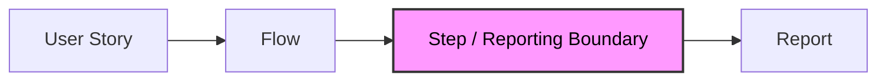

# @secorto/step

**A framework-agnostic reporting Anti-Corruption Layer where the execution strategy is decided at the call site, not
the implementation site.**

Most test automation suites suffer from a critical architectural flaw: **the execution strategy is hardcoded inside
component implementations instead of being selected by the test case.** Whether you use traditional *Page Objects* or
complex abstraction layers, this tight coupling forces you to repeat logic, leaks infrastructure noise, and creates a
massive disconnection between business intent, reporting boundaries, and runtime behavior.

`@secorto/step` fixes this by introducing a reporting Anti-Corruption Layer (ACL). It transforms your semantic steps
into lazy, immutable data structures, **separating step definition from step execution** to give you total fluid
control over how your tests run and report.

---

## ⚡ Quick Example

The exact same domain flow can execute under entirely different assertion strategies without modifying a single line of
your Page Object implementation:

```ts
const home = await visit(page, '/en', (p) => new HomePageMain(p))

await home.shouldBeLocalized()        // 1. Strict Execution: Halts the test instantly if any locator fails.
await home.shouldBeLocalized().soft() // 2. Intercepted Strategy: Propagates 'expect.soft' dynamically!
```

> **Same flow. Different execution strategy. The Page Object stays completely unchanged.**

---

## 🧠 Design Principles

People remember principles, not APIs. `@secorto/step` is built on five core architectural constraints:

* **Delegate implementation, never intention.** Flows can deeply delegate how they interact with subcomponents, but
    they must materialize their intent at their own level.
* **Flows are business language.** Your domain functions speak the language of user stories and are entirely
    invisible to the test runner.
* **Steps are reporting boundaries.** A step represents a single observable unit of work responsible for producing
    reporting metadata.
* **Execution is lazy by default.** Primitives do not execute anything in a cold state; they return deferred
    execution structures evaluated only at the call site.
* **Infrastructure is injected, never imported.** Your domain architecture remains 100% stable, even when underlying
    execution or reporting technologies change.

---

## 🚫 Why Not Native `test.step`?

If you are using Playwright, you might wonder why you shouldn't just wrap your interactions inside the native
`test.step` utility.

While native steps fix the visual narrative of the report, they introduce severe architectural limitations as your
test suite scales through three levels of maturity:

### Level 1: Raw Assertions (The Anti-Pattern)

The developer embeds raw assertions (`expect`) directly into the page method. If it fails, the report only says
*“Expect x to toBe”*. There is zero business narrative and zero traceability.

### Level 2: Infrastructure-Coupled Reporting (Native `test.step`)

The developer tries to fix the report by wrapping interactions inside the runner's native step utilities directly
inside the Page Object.

* **The Issue:** Infrastructure decisions leak into your domain layer. The code becomes noisy with nested async
    closures. More importantly, **you lose runtime strategy control**. You cannot trigger a soft assertion from the
    test case because native runner steps execute immediately and greedily.

### Level 3: Declarative Reporting Boundaries (`@secorto/step`)

Your page methods become clean declarative flows. Primitives do not execute anything in a cold state—they return a
**lazy, deferred execution structure**. Because execution is delayed until the test case actually awaits the step, you
can chain **Call-Site Modifiers** (like `.soft()`) to change the execution strategy dynamically.

### Report Noise vs. Semantic Cleanliness

Native assertions often leak implementation details into your reports. `@secorto/step` enforces strict reporting
boundaries, keeping your execution narrative pristine.

| Traditional Native Report (Noisy/Leaky) | `@secorto/step` Report (Clean/Semantic) |
| :--- | :--- |
| `✓ open homepage (0.5s)` `✗ expect(locator).toHaveText() (2.1s)` Expected: "Welcome" Received: "Bienvenido" | `✓ User opens homepage` `✗ Homepage components are localized (soft)` `✓ RSS language is loaded` |

---

## 🔌 Dependency Injection & Framework Independence

The library acts as a pure **Anti-Corruption Layer (ACL) for test reporting**, separating your domain architecture
from the reporting infrastructure. It does not depend on, nor import Playwright, Cypress, Vitest, Jest, or any
specific assertion engine.

Instead, you provide your runner's concrete reporting and assertion adapters via **Dependency Injection** at
initialization time. This guarantees that your core architectural model remains 100% stable, even when your underlying
execution or reporting technologies change.

---

## 📐 Core Philosophy & Architecture



* **Flow = The Business Intention.** A domain-level function or method representing a single, cohesive user action
    (e.g., `userInHome()`, `visit()`, or `shouldBeLocalized()`). Flows live in your Page Objects. They speak the
    language of your user stories, are pure TypeScript logic, and are entirely invisible to the test runner.
* **Step = The Reporting Boundary.** A Step represents an observable unit of work. It is responsible for producing
    reporting metadata and runtime behavior while remaining decoupled from the underlying test runner.

---

## 🧩 The 4 Core Primitives & Their Domains

`@secorto/step` separates responsibilities into four distinct building blocks, split across two high-level boundaries:
**The UI Domain** (your daily drivers) and **The Advanced Structural Domain** (for data streams and complex lifecycles).

```mermaid
graph TD
    A[What are you building?] --> B(Pure UI Interaction / Action)
    A --> C(UI Assertion / State Check)
    A --> D(Complex Structural / Data Flow)

    B -->|Ex: Click, Fill inputs| E[step]
    C -->|Ex: Verify element visibility| F[verifyStep]

    D --> G{Does the stream require immediate structural validation?}
    G -->|Yes: Ex. Navigation + Page Hydration| H[orchestrateStep]
    G -->|No: Ex. Fetching a parsed API/RSS payload| I[resourceStep]

    style E fill:#2563eb,color:#fff
    style F fill:#1d4ed8,color:#fff
    style H fill:#1e3a8a,color:#fff
    style I fill:#60a5fa,color:#111
```



### 1. The Core UI Domain (Daily Drivers)

Governs instantaneous interactions directly connected to the interface, user actions, and layout evaluations.

* **`step()` ── Responsibility: UI Actions (Imperative/Mutation)**
    Binds a business interaction directly to its functional block. It performs the physical work on the application
    state (e.g., clicking, typing) but does not evaluate states or execute assertions.
* **`verifyStep()` ── Responsibility: UI Assertions (Declarative/Validation)**
    Encapsulates an assertion alongside its execution context. It isolates and exposes the active assertion module to
    execute precise state verifications over your component trees.

### 2. The Data & Structural Domain (Advanced Lifecycles)

Governs architectural boundaries such as network pipelines, lazy schema transformations, and secure component
hydration.

* **`resourceStep()` ── Responsibility: Data Contracts & Inference (Data Flow)**
    Handles resource extraction, parsing, and deferred evaluations. Maps raw payloads (like an API or RSS feed) into
    typed domain objects, allowing your transformation blocks to return living structures or custom assertion behaviors.
* **`orchestrateStep()` ── Responsibility: Lifecycles & Checkpoints (Structural Setup)**
    Combines initialization logic with mandatory verification checkpoints. It executes an initialization sequence
    (like browser navigation or structural hydration) and enforces a mandatory, immediate verification checkpoint on
    the resulting object before delivering it to the test script.

---

## ⚙️ Runtime Modifiers: Strategy & Flow Control

Every step executes in a strict standard mode by default. However, because primitives are completely lazy, you can
chain explicit modifiers at the **call site** of the test case based on their structural capabilities:

| Primitive | Capabilities | Description |
| :--- | :--- | :--- |
| `step` | *None* | Pure interaction block without modifiers. |
| `verifyStep` | `.soft()` / `.with(expect)` | Assertion behavior control. |
| `resourceStep` | `.raw()` | Data transformation bypass. |
| `orchestrateStep` | `.soft()` / `.with(expect)` / `.raw()` | Full lifecycle control (Handles data and assertions). |

### Modifiers Reference

* **`.soft()`** *(Available in: `verifyStep`, `orchestrateStep`)*
    Swaps the underlying assertion engine to its soft variant and automatically appends `(soft)` to the report.
* **`.with(customExpect)`** *(Available in: `verifyStep`, `orchestrateStep`)*
    Enables manual Dependency Injection by overriding the active assertion engine dynamically at the call site.
* **`.raw()`** *(Available in: `resourceStep`, `orchestrateStep`)*
    Bypasses all verification blocks, schemas, and transformation layers entirely. It forces the step to resolve
    immediately with its pristine origin source payload.

---

## 🛡️ The Project Adapter: Enforcing Pure Dependency Injection

To initialize the reporting ACL, you provide your framework's raw concrete execution blocks (`test.step`, `expect`,
`expect.soft`) at a single initialization file (e.g., `tests/step.ts`):

```ts
import { expect, test } from '@playwright/test'
import { createTestingStep } from '@secorto/step'

export const {
  step,
  verifyStep,
  resourceStep,
  orchestrateStep
} = createTestingStep(test.step, expect, expect.soft)

export type { Step } from '@secorto/step'
```

---

## 🚀 Production Examples (Using Playwright as an Adapter Example)

### 1. UI Interaction Domain (`step` & `verifyStep`)

```ts
import { step, verifyStep } from '@tests/step'
import type { Page } from '@playwright/test'

export const openHomepage = (page: Page, locale: string) =>
  step(`user opens homepage in ${locale}`, async () => {
    await page.goto(`/${locale}/`)
  })

export class HomePageMain {
  readonly avatar = this.page.locator('.avatar')
  readonly bioText = this.page.locator('.bio-text')

  constructor(private page: Page) {}

  shouldBeLocalized() {
    return verifyStep('homepage main components are localized', async ({ expect }) => {
      await expect(this.avatar).toBeVisible()
      await expect(this.bioText).toHaveText(/Welcome/)
    })
  }
}
```

### 2. Data Stream Domain (`resourceStep`)

```ts
import { z } from 'zod'
import { resourceStep, verifyStep } from '@tests/step'
import type { APIRequestContext } from '@playwright/test'

const rssSchema = z.object({
  rss: z.object({ channel: z.object({ language: z.string() }) })
})

export const fetchRss = (request: APIRequestContext, locale: string) =>
  resourceStep(`fetch rss.xml (${locale})`, async () => {
    const response = await request.get(`/${locale}/rss.xml`)
    const body = await response.json()

    return {
      response,
      body: rssSchema.parse(body),
      shouldBeLoaded: (country: string) =>
        verifyStep(`rss language is ${country}`, async ({ expect }) => {
          expect(body.rss.channel.language).toBe(country)
        })
    }
  })
```

### 3. Lifecycle Domain (`orchestrateStep`)

```ts
import { orchestrateStep } from '@tests/step'
import type { Page } from '@playwright/test'

export const visit = <T extends { shouldBeLoaded: () => any }>(
  page: Page,
  url: string,
  factory: (page: Page) => T
) =>
  orchestrateStep(
    `Navigate and initialize page: ${url}`,
    async () => {
      await page.goto(url)
      return factory(page)
    },
    async (pageObject, { expect }) => {
      await pageObject.shouldBeLoaded().with(expect)
      return pageObject
    }
  )
```

---

## 🎬 Execution at the Call Site (The Test Case)

```ts
import { test } from '@playwright/test'
import { visit, fetchRss } from '@tests/flows'
import { HomePageMain } from '@tests/pages'

test('evaluating application states via strategy control', async ({ page, request }) => {
  // 1. Strict Execution (Default Behavior)
  const home = await visit(page, '/en', (p) => new HomePageMain(p))

  // 2. Chained Soft Assertions (.soft)
  await home.shouldBeLocalized().soft()

  // 3. Bypassing Processors (.raw)
  const rawRss = await fetchRss(request, 'en').raw()
})
```

## License

MIT
