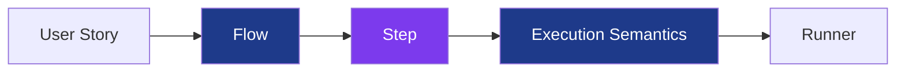
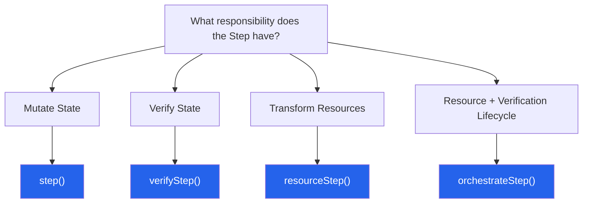

# @secorto/step

**Define a flow once. Choose its execution semantics at the call site.**

`@secorto/step` is a framework-agnostic execution semantics model for test automation.

Most automation frameworks couple business intent with execution behavior. A flow not only describes what should happen,
but also how assertions execute, how failures propagate, and how reporting is produced.
As a result, small differences in execution strategy often lead to duplicated implementations
 and infrastructure concerns leaking into domain code.

`@secorto/step` separates intent from execution semantics by transforming automation behaviors into lazy,
immutable execution artifacts.

Flows define intent.

Steps materialize intent.

Consumers choose execution semantics.

This allows the same flow to be executed under different runtime strategies
(`strict`, `soft`, `raw`, or custom assertion contexts) without modifying its implementation.

The result is reusable automation flows, explicit reporting boundaries, lower infrastructure coupling,
and execution behavior that can evolve independently from business intent.

---

## ⚡ Quick Example

```ts
const home = await visit(page, '/en', (p) => new HomePageMain(p))

await home.shouldBeLoaded()
await home.shouldBeLoaded().soft()
```

---

## 📐 Architectural Overview



Automation begins with business intent.

Flows capture intent.

Steps materialize intent.

Execution semantics are selected by consumers.

Runners execute the resulting behavior through framework adapters.

---

## Core Concepts

### Flow

A Flow is a named unit of intent.

Flows are units of composition and meaning.

They describe what we want to achieve, not how the work is executed.

A Flow may:

- compose other Flows
- delegate implementation
- hide infrastructure details

Flows define intent.

### Step

A Step is an observable execution artifact.

Steps are units of execution and observability.

They materialize a Flow's intent into executable work while remaining decoupled from the underlying test runner.

Only Steps execute.
Only Steps are observable.

### Primitives

The library provides four specialized Step types:

- `step()` → actions
- `verifyStep()` → verification strategies
- `resourceStep()` → resource transformations
- `orchestrateStep()` → resource and verification orchestration

### Modifiers

Execution semantics are selected at the call site:

- `.soft()`
- `.with(expect)`
- `.raw()`

The same Flow can be consumed under different execution semantics without changing its implementation.

---

## 🧠 Design Principles

People remember principles, not APIs. `@secorto/step` is built on five core architectural constraints:

- **Delegate implementation, never intention.** Flows can deeply delegate how they interact with subcomponents, but
    they must materialize their intent at their own level.
- **Flows are business language.** Your domain functions speak the language of user stories and are entirely
    invisible to the test runner.
- **Steps are execution and reporting boundaries.** A Step represents a single observable unit of work
    responsible for materializing intent, producing runtime behavior, and defining reporting boundaries.
- **Execution is lazy by default.** Primitives do not execute anything in a cold state; they return deferred
    execution structures evaluated only at the call site.
- **Infrastructure is injected, never imported.** Your domain architecture remains 100% stable, even when underlying
    execution or reporting technologies change.

---

## 🚫 Why Not Native `test.step`?

`test.step()` improves reporting, but it does not separate intent from execution semantics.

Because native steps execute eagerly, execution behavior becomes part of the implementation itself.

As a result:

- execution strategies become embedded in Flows
- infrastructure concerns leak into domain code
- different execution behaviors often require multiple implementations of the same intent

`@secorto/step` takes a different approach.

Flows define intent.

Steps materialize intent.

Consumers choose execution semantics.

Because execution artifacts are lazy, modifiers such as `.soft()`, `.with()`, and `.raw()`
can be selected dynamically at the call site without modifying the Flow implementation.

---

## 🔌 Dependency Injection & Framework Independence

The library remains completely independent from test runners, reporting tools, and assertion engines.

Architecturally, @secorto/step acts as an Anti-Corruption Layer (ACL) between automation Flows and execution infrastructure.

Instead of importing framework-specific dependencies directly into your domain code,
execution and assertion behavior are injected through adapters during initialization.

---

## 🧩 The 4 Core Primitives

Each primitive exists to model a distinct execution responsibility while preserving the same execution model.



### `step()`

**Responsibility:** Actions

Use when work directly changes system state.

Typical examples:

- clicking
- typing
- submitting forms
- triggering navigation
- mutating application state

`step()` performs observable work but does not evaluate state or execute assertions.

---

### `verifyStep()`

**Responsibility:** Verification

Use when work validates state, behavior, or expectations.

Capabilities:

- `.soft()`
- `.with(expect)`

`verifyStep()` encapsulates assertions while allowing consumers to choose the verification strategy at the call site.

---

### `resourceStep()`

**Responsibility:** Resource Acquisition & Transformation

Use when work retrieves a resource and transforms it into a domain-specific representation.

Capabilities:

- `.raw()`

`resourceStep()` models a two-stage pipeline:

```text
origin → transformation
```

Consumers may execute the full pipeline or bypass transformation entirely by using `.raw()`.

---

### `orchestrateStep()`

**Responsibility:** Resource Lifecycle Orchestration

Use when resource acquisition and verification belong to the same lifecycle and must execute as a single observable artifact.

Capabilities:

- `.soft()`
- `.with(expect)`
- `.raw()`

`orchestrateStep()` combines resource and verification semantics while preserving execution strategy control
at the call site.

Typical examples:

- page initialization (`visit()`)
- accessibility audits (`a11yFlow()`)

---

## ⚙️ Runtime Modifiers

Modifiers allow consumers to select execution semantics at the call site.

### `.soft()`

*(Available in: `verifyStep()`, `orchestrateStep()`)*

Swaps the underlying assertion engine to its soft variant and automatically appends `(soft)` to the report.

### `.with(customExpect)`

*(Available in: `verifyStep()`, `orchestrateStep()`)*

Overrides the active assertion implementation at the call site.

### `.raw()`

*(Available in: `resourceStep()`, `orchestrateStep()`)*

Bypasses verification and transformation layers, resolving directly with the original resource produced by the origin source.

---

## 🛡️ Adapter Setup

Architecturally, this is where the Anti-Corruption Layer (ACL) is established.

Instead of allowing Flow and Step definitions to depend directly on framework-specific primitives
such as `test.step`, `expect`, or `expect.soft`, `@secorto/step` isolates those concerns behind a small adapter.

During initialization, you provide the concrete execution and assertion implementations used by your test framework:

```ts
import { expect, test } from '@playwright/test'
import { createTestingStep } from '@secorto/step'

export const {
  step,
  verifyStep,
  resourceStep,
  orchestrateStep
} = createTestingStep(
  test.step,
  expect,
  expect.soft
)

export type { Step } from '@secorto/step'
```

This keeps Flow definitions stable while allowing execution infrastructure to evolve independently.

---

## 🚀 Production Examples (Using Playwright as an Adapter Example)

### 1. Action & Verification Example (`step()` + `verifyStep()`)

```ts
export class HomePageMain {
  readonly themeToggle: Locator
  readonly avatar: Locator
  readonly bioText: Locator

  constructor(private readonly page: Page) {
    this.themeToggle = page.getByTestId('theme-toggle')
    this.avatar = page.locator('.avatar')
    this.bioText = page.locator('.bio-text')
  }

  toggleTheme() {
    return step('toggle theme', async () => {
      await this.themeToggle.click()
    })
  }

  shouldBeLoaded() {
    return verifyStep(
      'homepage main components are loaded',
      async ({ expect }) => {
        await expect(this.avatar).toBeVisible()
        await expect(this.bioText).toBeVisible()
      }
    )
  }
}
```

### 2. Resource Transformation Example (`resourceStep()`)

```ts
export const robotsParser = async (response: APIResponse) => {
  const body = await response.text()

  return {
    response,
    body,

    shouldBeLoaded: () =>
      verifyStep('robots.txt is loaded', async ({ expect }) => {
        expect(body).toContain('User-agent: *')
        expect(body).toContain('Allow: /')
      })
  }
}

export const robots = (request: APIRequestContext) =>
  resourceStep(
    'fetch robots.txt',
    async () => request.get('/robots.txt'),
    robotsParser,
  )
```

### 3. Lifecycle Orchestration Example (`orchestrateStep()`)

```ts
import { orchestrateStep } from '@tests/step'
import type { Page } from '@playwright/test'

export const visit = <T extends { shouldBeLoaded: () => any }>(
  page: Page,
  url: string,
  factory: (page: Page) => T
) =>
  orchestrateStep(
    `Navigate and initialize page: ${url}`,
    async () => {
      await page.goto(url)
      return factory(page)
    },
    async (pageObject, { expect }) => {
      await pageObject.shouldBeLoaded().with(expect)
      return pageObject
    }
  )
```

---

## 🎬 Execution at the Call Site (The Test Case)

```ts
import { test } from '@playwright/test'
import { visit, robots } from '@tests/flows'
import { HomePageMain } from '@tests/pages'

test('evaluating application states via strategy control', async ({ page }) => {
  // 1. Strict Execution (Default Behavior)
  const home = await visit(page, '/en', (p) => new HomePageMain(p))

  // 2. Chained Soft Assertions (.soft)
  await home.shouldBeLoaded().soft()
})

test('validate robots file', async ({ request }) => {
  // 3. Validate the happy path
  const robotsFile = await robots(request)
  await robotsFile.shouldBeLoaded()
})
```

### Raw test

```ts
import { test, expect } from '@playwright/test'
import { robots } from '@tests/flows'

test('validate robots response using raw', async ({ request }) => {
  // 4. Bypassing Processors (.raw)
  const raw = await robots(request).raw()
  expect(raw.ok()).toBeTruthy()
})
```

## License

MIT
